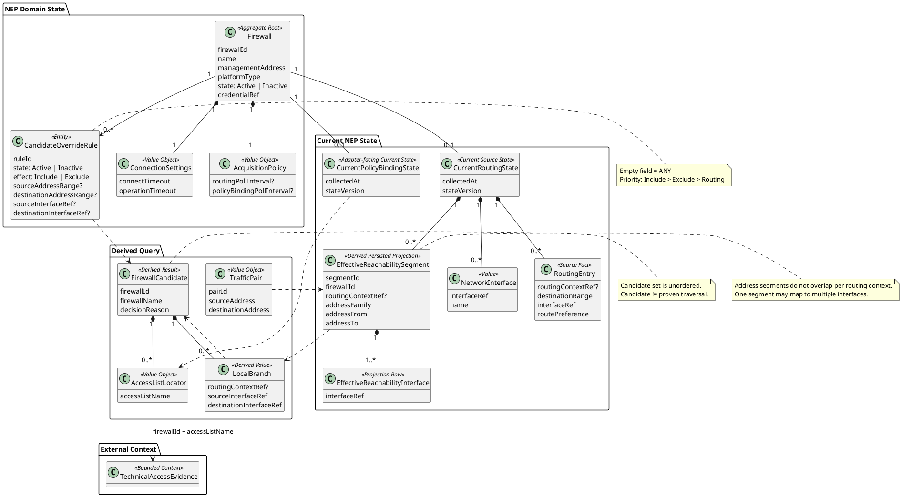

# Network Enforcement Placement — Target Tactical Model

Status: `accepted target Tactical DDD model; implementation migration pending`.

Date: 2026-09-13.

Decision: `../../decisions/ADR-018-nep-firewall-current-state-candidate-model.md`.

This document is the canonical MVP target model for NEP. `tactical-model.md` remains historical/current-runtime documentation for the stronger I19 proven-path implementation until migration is completed.

## 1. Purpose

Network Enforcement Placement answers:

> for each technical source/destination address pair, which known Firewalls are relevant enough to inspect, which firewall-local interface branches may carry the traffic, and which ACL/policy names must be inspected downstream?

NEP does not select one optimal route and does not claim a proven end-to-end path. It deliberately preserves every locally possible branch needed to avoid missing an enforcement point.

## 2. Ownership boundary

| Knowledge | Owner | Notes |
|---|---|---|
| Firewall identity/profile | NEP | `Firewall` is the unit of account; no separate physical Device in MVP |
| Active/Inactive state | NEP | admin-controlled through Web UI |
| Current routing/interface state | NEP | latest successful state only |
| Routing-context-aware effective reachability | NEP derived projection | rebuildable from current routing state |
| Candidate override rules | NEP | `Include > Exclude > Routing` |
| Firewall candidate calculation | NEP | relevance, not proven traversal |
| Relevant ACL/policy names | NEP | distinct union across every relevant local branch |
| ACL/policy bodies and entries | Technical Access Evidence | acquired independently |
| Resource/application identity | RC / ACC | outside NEP |
| Desired-vs-configured reconciliation | APR/downstream composition | outside NEP |

NEP is not a generic CMDB.

## 3. Ubiquitous language

### Firewall

One independently addressed and analysed firewall context with its own routing/interface/policy semantics.

```text
Firewall
    firewallId
    name
    managementAddress
    platformType
    state: Active | Inactive
    credentialRef
    connectionSettings
    acquisitionPolicy
```

`Active` participates in polling and candidate calculation. `Inactive` remains configured but is ignored. No separate lifecycle/command model is required for MVP.

### TrafficPair

Ephemeral batch query value:

```text
TrafficPair
    pairId
    sourceAddress
    destinationAddress
```

MVP uses current state and has no `asOf`.

### LocalBranch

One firewall-local source-interface/destination-interface possibility inside one routing context:

```text
LocalBranch
    routingContextRef?
    sourceInterfaceRef
    destinationInterfaceRef
```

A LocalBranch is not proof of actual traversal. It exists so NEP can inspect policy applicability on every locally possible branch.

### FirewallCandidate

A Firewall is a candidate when routing or an override says it is relevant enough to inspect. Candidate ordering has no route meaning.

### AccessListLocator

For MVP the locator is intentionally minimal:

```text
AccessListLocator
    accessListName
```

A stable `accessListRef` is deferred until a concrete source/consumer proves that the name is insufficient.

## 4. Persisted state

### 4.1 Firewall aggregate

`Firewall` is the primary NEP-owned persistent identity.

```text
ConnectionSettings
    connectTimeout
    operationTimeout

AcquisitionPolicy
    routingPollInterval?
    policyBindingPollInterval?
```

Intervals and timeouts are per Firewall because routing volatility and connection cost differ. Secret values are external; only an opaque reference is stored.

### 4.2 CandidateOverrideRule

```text
CandidateOverrideRule
    ruleId
    firewallId
    state: Active | Inactive
    effect: Include | Exclude

    sourceAddressRange?
    destinationAddressRange?
    sourceInterfaceRef?
    destinationInterfaceRef?
```

Empty fields mean `ANY`. Only Active rules participate.

### 4.3 CurrentRoutingState

```text
CurrentRoutingState
    firewallId
    collectedAt
    stateVersion
    interfaces[]
    routingEntries[]
```

Only the latest successful state is retained. A refresh builds, validates and atomically publishes the new routing state together with all derived reachability data. `stateVersion` is a consistency mechanism, not historical identity.

### 4.4 CurrentPolicyBindingState

Policy-binding metadata may be refreshed independently from routing state and may stay vendor-shaped behind the adapter. The domain only requires enough current source knowledge to resolve all relevant ACL/policy names for retained local branches.

NEP does not require universal attachment topology in the core model.

## 5. Effective reachability projection

Raw routes may overlap and may have ECMP/multipath results. NEP derives a persisted read model that resolves normal prefix precedence while preserving every equally valid interface.

Conceptual model:

```text
EffectiveReachabilitySegment
    firewallId
    routingContextRef?
    addressFamily
    addressFrom
    addressTo
    interfaces[1..N]
```

Relational implementations may split interface membership into child rows:

```text
EffectiveReachabilitySegment
    segmentId
    firewallId
    routingContextRef?
    addressFamily
    addressFrom
    addressTo

EffectiveReachabilityInterface
    segmentId
    interfaceRef
```

Invariants:

- within one Firewall + routing context + address family, address segments do not overlap;
- one segment may have multiple interfaces;
- projection is rebuildable/replaceable and not routing source truth;
- projection switches atomically with the current routing state;
- no arbitrary ECMP winner is invented.

This projection exists to support set-based PostgreSQL evaluation across all input pairs and Firewalls.

## 6. Routing contexts / VRF

If a Firewall exposes routing contexts such as VRFs, route facts and effective reachability preserve `routingContextRef`.

Current `TrafficPair` has no routing-context selector. Therefore NEP evaluates all applicable contexts and conservatively retains every resulting local branch. A future stronger input contract may narrow the context explicitly.

## 7. Candidate calculation

For every active Firewall with current routing state and every TrafficPair:

```text
for each routingContext:
    sourceInterfaces = resolve(sourceAddress)
    destinationInterfaces = resolve(destinationAddress)
    localBranches = sourceInterfaces × destinationInterfaces
```

A branch is routing-relevant when:

```text
sourceInterfaceRef != destinationInterfaceRef
```

The Firewall is a routing candidate when at least one routing-relevant branch exists.

This means ECMP/multipath produces multiple retained branches rather than one chosen interface.

### Route lookup miss

If source and/or destination does not resolve in an otherwise valid current state:

```text
routingCandidate = false
```

and a diagnostic is recorded. Override evaluation still runs.

No separate `NetworkResolution` domain entity/state machine is required.

### Missing current routing state

If an Active Firewall has no current routing state, MVP skips that Firewall and records `CURRENT_ROUTING_STATE_MISSING`. It is not added as a candidate merely because its state is unknown.

## 8. Override matching

Address conditions match the queried pair directly.

For interface conditions, a rule matches only if there exists a resolved LocalBranch in one routing context satisfying all specified interface conditions. A specified interface condition cannot match when that interface is unresolved.

Precedence:

```text
if matching Include exists:
    candidate = true
else if matching Exclude exists:
    candidate = false
else:
    candidate = routingCandidate
```

Therefore:

```text
Include > Exclude > Routing
```

An Include may override a route lookup miss inside a valid current state. It does not manufacture current state when none exists.

## 9. ACL/policy-name resolution across branches

For one FirewallCandidate, the vendor adapter determines policy applicability for every retained LocalBranch.

Conceptual port:

```text
ResolveRelevantAccessLists(
    firewall,
    pair,
    localBranches[]
) -> AccessListLocator[]
```

Required semantics:

```text
result = DISTINCT UNION(
    applicable ACL/policy names for each relevant branch
)
```

NEP must not assume parallel paths use the same ACL even when that is operationally common.

The core domain does not require attachment kind, direction, ingress/global/egress classification or evaluation position. Those are adapter mechanics until a concrete consumer requires them.

## 10. Independent acquisition

NEP acquisition reads only what NEP needs:

```text
interfaces
routing
minimal policy-binding/locator metadata
```

TAE independently acquires ACL/policy bodies when configured evidence is required, ideally only for the selected access-list names where the source permits targeted reads.

The acquisitions may differ in schedule, trigger, command/API, timeout and capture identity. Low-level transport code may be shared without merging ownership.

## 11. Batch query shape

```text
AnalyzeTrafficPairs(TrafficPair[])
    -> TrafficPairResult[]

TrafficPairResult
    pairId
    candidates[]              # unordered

FirewallCandidate
    firewallId
    firewallName
    localBranches[]
    accessLists[]             # distinct names across all relevant branches
    decisionReason

LocalBranch
    routingContextRef?
    sourceInterfaceRef
    destinationInterfaceRef

AccessListLocator
    accessListName
```

Useful decision reasons:

```text
IncludedByRouting
ExcludedByRouting
IncludedByOverride
ExcludedByOverride
```

## 12. Diagnostics

Operational misses are observable but do not form a new domain lifecycle:

```text
CURRENT_ROUTING_STATE_MISSING
ROUTE_LOOKUP_MISS
```

Logging should carry at least `firewallId`, `pairId` where applicable, and enough side/context information to diagnose the miss.

## 13. Canonical ERD



## 14. Tactical classification

| Concept | Tactical type | Persistence | Identity/lifecycle |
|---|---|---|---|
| `Firewall` | Aggregate Root | yes | stable `firewallId`; admin-controlled `Active/Inactive` |
| `ConnectionSettings` | Value Object | inside Firewall | none |
| `AcquisitionPolicy` | Value Object | inside Firewall | none |
| `CandidateOverrideRule` | Entity | yes | stable `ruleId`; `Active/Inactive` |
| `CurrentRoutingState` | current source state | current only | atomic replacement; no history identity |
| `NetworkInterface` | current-state value | current only | source-qualified within Firewall state |
| `RoutingEntry` | normalized source fact | current only/implementation | no independent business identity |
| `EffectiveReachabilitySegment` | derived persisted projection | yes | rebuildable |
| `EffectiveReachabilityInterface` | derived projection row | yes | child of segment |
| `CurrentPolicyBindingState` | adapter-facing current state | if required | replaceable/current only |
| `TrafficPair` | query value | no | none |
| `LocalBranch` | derived value | no | none |
| `FirewallCandidate` | derived result | no | none |
| `AccessListLocator` | Value Object | result/current adapter state | `accessListName` for MVP |

## 15. Accepted invariants

1. `Firewall` is the NEP unit of account; no physical Device entity is required by MVP.
2. Firewall state is only `Active/Inactive` for MVP.
3. Query input is `TrafficPair[1..N]`; no `asOf`.
4. Candidate means relevance-to-inspect, not proven traversal.
5. Candidate order has no route meaning.
6. NEP retains only current successful routing/interface state.
7. Routing state and derived reachability switch atomically.
8. Routing-context/VRF identity is preserved when present.
9. Effective address segments do not overlap within one Firewall/context/address family.
10. One effective segment may map to multiple equal-cost interfaces.
11. ECMP/multipath branches are preserved; NEP never picks an arbitrary winner.
12. A Firewall is a routing candidate if any retained branch has different source/destination interfaces.
13. Route lookup miss gives routing false, is diagnosed, and does not block override evaluation.
14. Missing current routing state causes the Firewall to be skipped and diagnosed.
15. Empty override fields mean `ANY`; only Active rules participate.
16. `Include > Exclude > Routing`.
17. ACL/policy applicability is evaluated for every retained local branch.
18. Final access-list result is the distinct union across branches.
19. `AccessListLocator` contains only `accessListName` in MVP.
20. NEP and TAE acquire source data independently.
21. Per-Firewall connection timeouts and acquisition intervals are configurable.
22. Retry/backoff and unsupported vendor-specific routing details are implementation concerns until required.

## 16. Current implementation gap

### P0

- current I19/I26 runtime is still centred on provider/device/path/candidate structures rather than the target `Firewall` unit of account;
- current runtime does not implement user `CandidateOverrideRule` with `Include > Exclude > Routing`;
- current persistence is not organized around current routing state plus atomically replaceable effective reachability;
- target multipath/VRF-aware `LocalBranch` derivation is not implemented;
- target set-based batch candidate evaluation is not implemented.

### P1

- current ADR-017 attachment shape contains topology fields no longer required by target core output;
- current acquisition does not yet express independent NEP routing/policy-binding versus TAE policy-body collection;
- per-Firewall platform/connection/acquisition profile is not yet the runtime model;
- target diagnostics for missing current state / route lookup miss are not yet standardized.

## 17. Deferred implementation details

The following do not block the target model:

- concrete secret/profile storage;
- retry/backoff/scheduler failure policy;
- vendor-specific PBR or other unsupported routing semantics when/if required;
- migration roadmap from current I19/I26 code and persistence.
