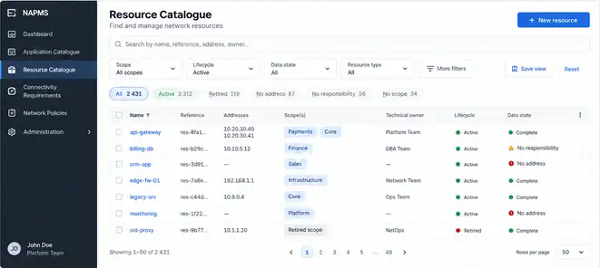
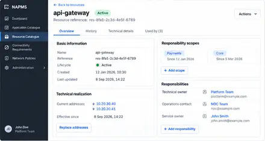
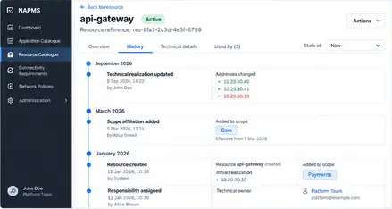

# Resource Catalogue wireframes

Status: `accepted and implemented through PR #81`.

Date: 2026-09-11.

These wireframes define the intended screen structure, information priority and interaction shape for Resource Catalogue. They are implementation-oriented UI guidance, not a new domain model and not a pixel-perfect specification.

Canonical product/domain semantics remain owned by:
- `docs/requirements/catalogue-curation.md`;
- `docs/domain/resource-catalogue/tactical-model.md`;
- `docs/domain/resource-role-model.md`;
- `docs/architecture/catalogue-curation-boundary.md`.

Visual references derived from these wireframes:
- `docs/ui/references/resource-catalogue/catalogue-list.svg`;
- `docs/ui/references/resource-catalogue/resource-overview.svg`;
- `docs/ui/references/resource-catalogue/resource-history.svg`;
- `docs/ui/references/resource-catalogue/new-resource.svg`.

The SVG files are explanatory pictures. This Markdown document is the implementation contract when a visual detail conflicts with text or canonical domain/requirements semantics.

## 1. Resource Catalogue list

Primary job: find a Resource quickly, understand its current realization/scope/responsibility state, and open the Resource detail.

```text
Resource Catalogue                                           [+ New resource]
Find and manage network-relevant resources.

[ Search by name, reference, address, scope or owner...................... ]

Scope                    Lifecycle           Data state
[ All scopes          ]   [ Active        ▾]  [ All                  ▾] [Apply] [Reset]

[ All ] [ No address ] [ No responsibility ] [ No scope ]

Name              Reference      Addresses          Scope(s)      Technical owner     Lifecycle   Data state
api-gateway       res-a31…       10.20.30.40        Payments      Platform Team       Active      No missing facts
orders-db         res-b42…       10.20.40.10        Orders        Database Team       Active      No responsibility
legacy-dns        res-c19…       —                  Core          —                   Active      No address
batch-worker      res-d80…       10.20.55.23        —             Runtime Team        Active      No scope
...

Page 1 · up to 50 resources per page                                      [Previous] [1] [Next]
```

### Rules

- Use a dense server-backed table, not dashboard cards or a hierarchy-first browser.
- Search covers readable name/reference plus current address, current Responsibility Scope and current responsibility display/reference/contact where supported by the read projection.
- Scope, lifecycle and missing-fact filters are server-backed.
- Normal view defaults to Active Resources; Retired is opt-in.
- `Resource type` is intentionally absent because Resource Catalogue has no accepted first-class Resource type attribute.
- Data-state text is diagnostic only. It may show concrete missing current facts such as `No address`, `No scope`, `No responsibility`.
- Do not invent `Complete`, `Ready`, health scores or similar aggregate domain states.
- Optional responsibility contact is not a completeness invariant.
- Multiple missing facts may be shown simultaneously.
- Multiple current scopes are chips/summary; multiple TechnicalOwner responsibilities may be summarized without implying a mandatory primary owner.
- Stable IDs are secondary to readable names but remain available.



## 2. Resource detail — Overview

Primary job: understand and change the current effective Resource facts without exposing generic CRUD.

```text
← Back to resources

api-gateway        Active                                      [Actions ▾]
Resource reference: res-a31...

Overview | History | Technical details

┌ Basic information ──────────────────────────┐  ┌ Responsibility scopes ─────────────────────┐
│ Name               api-gateway              │  │ Payments                         [End]       │
│ Reference          res-a31...               │  │ Core                             [End]       │
│ Lifecycle          Active                   │  │                                  [+ Add]    │
│ Version            v7                       │  └─────────────────────────────────────────────┘
│ State read at      2026-09-11 18:00         │
└─────────────────────────────────────────────┘  ┌ Responsibilities ───────────────────────────┐
                                                   │ Technical owner                            │
┌ Technical realization ─────────────────────┐  │ Platform Team                              │
│ 10.20.30.40                                 │  │ platform@example.test              [End]    │
│ 10.20.30.41                                 │  │                                             │
│ Effective since ...                        │  │ Operations contact                          │
│                         [Replace addresses] │  │ NOC Team                            [End]    │
└─────────────────────────────────────────────┘  │                            [+ Add responsibility]│
                                                   └─────────────────────────────────────────────┘
```

### Rules

- Overview shows current effective facts first.
- Technical realization is edited semantically as `Add addresses` when absent or `Replace addresses` when one current realization exists.
- Replacement ends the current realization and creates a successor; the UI does not rewrite history.
- Scope affiliation and Responsibility assignments are added/ended independently.
- Responsibility roles remain explicit (`Technical owner`, `Service owner`, `Operations contact`, `Business owner`).
- Multiple simultaneous responsibilities are normal; no mandatory primary assignment is implied.
- Rename and Retire live under Resource-level actions.
- Retirement may be blocked until current scope affiliations and responsibilities are ended; the UI explains the domain conflict rather than offering hard delete.
- A Resource may legitimately exist with no current realization, no current scope affiliation or no current responsibility.



## 3. Resource detail — History

Primary job: inspect temporal fact history without pretending that Resource Catalogue is event-sourced.

```text
api-gateway        Active                                      [Actions ▾]

Overview | History | Technical details

Resource history                                              State at: Now
Temporal realization, scope-affiliation and responsibility changes.

September 2026
● Technical realization started                 Sep 11, 18:02
  10.20.30.40, 10.20.30.41
  Fact fact-...

● Responsibility assigned                       Sep 11, 17:50
  Technical owner · Platform Team

● Scope affiliation added                       Sep 11, 17:45
  Payments

● Technical realization ended                   Sep 10, 09:20
  10.20.10.14
  End provenance prov-...
```

### Rules

- History is a read-only projection derived from temporal facts.
- It may synthesize a chronological timeline from `validFrom`, `validTo`, versions and provenance; those rows are not domain events unless the domain explicitly defines them as such.
- Start/end of realization, scope affiliation and responsibility facts are visible.
- Current/as-of detail and full history are separate read concerns.
- Historical viewing must not expose mutation actions against the historical projection.
- If a future historical-state selector is added, non-`Now` state is explicitly read-only and offers a clear return to current state.



## 4. New Resource

Resource creation stays lightweight because Resource identity may validly exist before realization/scope/responsibility facts are supplied.

```text
New resource
NAPMS generates the stable resource reference.

Display name
[ api-gateway......................................... ]

                                      [Cancel] [Create resource]
```

After creation, navigate to the Resource detail where realization, scope affiliations and responsibilities can be added incrementally. Do not force a wizard that implies those facts are mandatory for Resource existence.


## 5. Technical details

Technical detail keeps identifiers/provenance available without leading the normal workflow.

```text
Resource identity
Resource reference       res-a31...
Version                  7
Creation provenance      prov-create-...
Retirement provenance    —

Current fact references
Realization              fact-... · v3
Scope affiliation        aff-... · v1
Responsibility           resp-... · v2
```

Readable business/operational labels lead elsewhere. Technical identifiers exist for traceability and support/debugging.

## 6. Explicit non-goals

The Resource Catalogue UI must not imply:
- generic CMDB hierarchy or arbitrary object types;
- `Company → Scope → Resource → Endpoint` as a mandatory tree;
- a single canonical owner when several responsibility assignments can coexist;
- responsibility/scope affiliation as authorization;
- generic Edit/Delete CRUD over temporal facts;
- synthetic `Complete`, `Ready`, `Healthy` or scoring semantics;
- resource classification inferred from IP addresses or realization shape.
