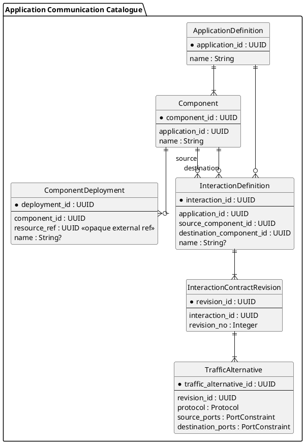

# Application Communication Catalogue — Target Domain Model

Status: `S2 revalidated target; implementation pending`.

Decision: `../../decisions/ADR-015-acc-component-deployment-and-atomic-interaction-contract.md`.

This document is the canonical target domain model for Application Communication Catalogue. It does not claim that the current I31 runtime already implements this shape.

## Model

```text
ApplicationDefinition
  -> Component
      -> ComponentDeployment -> exactly one ResourceRef

ApplicationDefinition
  -> InteractionDefinition
      -> source Component
      -> destination Component
      -> InteractionContractRevision
          -> TrafficAlternative [1..N]
```

### ApplicationDefinition

Stable ACC-owned identity grouping Components and their declared interactions.

Minimum semantic facts:

```text
applicationId
name
description?
lifecycle when later required
```

### Component

Stable ACC-owned deployable application role inside one Application Definition.

Minimum semantic facts:

```text
componentId
applicationId
name
description?
```

The parent Application is immutable for the Component lifetime.

### ComponentDeployment

Concrete deployment of one Component on one Resource.

Minimum semantic facts:

```text
componentDeploymentId
componentId
resourceRef
name?
```

Invariants:

- parent Component is immutable;
- `resourceRef` is mandatory at creation;
- exactly one ResourceRef belongs to one ComponentDeployment in MVP;
- ResourceRef is stable for that deployment lifetime;
- moving the Component to another Resource creates a different ComponentDeployment;
- Resource Endpoint/address changes on the same Resource do not change ComponentDeployment identity.

`resourceRef` is an opaque Resource Catalogue identifier. ACC does not own Resource attributes or endpoint/address realization.

No endpoint-specific deployment binding is defined yet.

### InteractionDefinition

Stable ACC-owned directed communication definition between two Components.

Minimum semantic facts:

```text
interactionId
applicationId
sourceComponentId
destinationComponentId
name?
```

### InteractionContractRevision

Immutable decision-relevant communication contract revision of one Interaction Definition.

Minimum semantic facts:

```text
revisionId
interactionId
revisionNumber
createdAt
```

A revision has one or more `TrafficAlternative` values and is immutable after creation. Changing decision-relevant traffic creates a new revision.

### TrafficAlternative

One vendor-neutral traffic selector inside an immutable interaction contract revision.

Minimum semantic facts:

```text
trafficAlternativeId
revisionId
protocol
sourcePorts
destinationPorts
```

All alternatives in one revision form one atomic contract. Consumers cannot authorize only part of them. Independently governed traffic subsets are separate Interaction Definitions.

## Published semantic contract

ACC publishes a concrete deployed interaction as:

```text
DirectedInteractionIdentity {
    sourceComponentDeploymentRef
    destinationComponentDeploymentRef
    interactionContractRevisionRef
}
```

This is a value contract, not a required separate aggregate/table.

ACC validates:

```text
sourceDeployment.componentId == interaction.sourceComponentId
destinationDeployment.componentId == interaction.destinationComponentId
revision.interactionId == interaction.interactionId
```

Consumers treat all three identifiers as opaque ACC references.

## Resource realization semantics

For MVP:

```text
ComponentDeployment -> exactly one Resource
Resource -> ResourceEndpoint[0..N]
ResourceEndpoint -> current address realization
```

Only the first relation is ACC truth; Endpoint/address truth belongs to Resource Catalogue.

Consequences:

- an authorization subject can exist while Endpoint/address realization is unresolved;
- address changes on the same Resource do not alter ComponentDeployment/interaction identity;
- moving the Component to another Resource produces a new ComponentDeployment and therefore a different concrete authorization subject;
- replicas on distinct Resources are distinct ComponentDeployments rather than one deployment with several Resource bindings.

## Cross-context persistence rule

A consumer may physically store the published subject references in its own persistence, but they are not domain foreign keys into ACC tables. Cross-context validity is established via published ACC contracts/adapters.

## Normative PlantUML



## Deferred questions

- optional ComponentDeployment -> ResourceEndpoint binding;
- network-context-dependent endpoint visibility and NAT exposure;
- migration implementation from I31 ApplicationDeployment / DeploymentInteraction and previous multi-binding assumptions;
- persistence/repository structure;
- richer lifecycle states not required by current G1 behavior.
