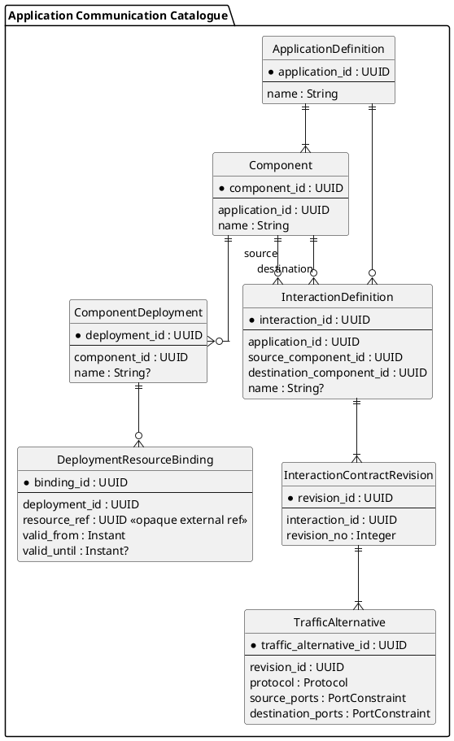

# Application Communication Catalogue — Target Domain Model

Status: `accepted target; implementation pending`.

Decision: `../../decisions/ADR-015-acc-component-deployment-and-atomic-interaction-contract.md`.

This document is the canonical target domain model for Application Communication Catalogue. It does not claim that the current I31 runtime already implements this shape.

## Model

```text
ApplicationDefinition
  -> Component
      -> ComponentDeployment
          -> DeploymentResourceBinding -> ResourceRef

ApplicationDefinition
  -> InteractionDefinition
      -> source Component
      -> destination Component
      -> InteractionContractRevision
          -> TrafficAlternative [1..N]
```

### ApplicationDefinition

Stable ACC-owned identity that groups Components and their declared interactions.

Minimum facts:

```text
applicationId
name
description?
lifecycle
```

### Component

Stable ACC-owned deployable application role inside exactly one Application Definition.

Minimum facts:

```text
componentId
applicationId
name
description?
lifecycle
```

The parent Application is immutable for the Component lifetime.

### ComponentDeployment

Concrete deployment of one Component.

Minimum facts:

```text
componentDeploymentId
componentId
name?
lifecycle
```

The parent Component is immutable. Resource placement is not part of Component Deployment identity.

### DeploymentResourceBinding

Temporal ACC-owned relation between one Component Deployment and one Resource Catalogue Resource reference.

Minimum facts:

```text
bindingId
componentDeploymentId
resourceRef
validFrom
validUntil?
```

`resourceRef` is opaque. ACC does not own Resource attributes.

One Component Deployment may have zero, one or many effective Resource bindings.

No endpoint-specific binding is defined yet.

### InteractionDefinition

Stable ACC-owned directed communication definition between two Components of one Application Definition.

Minimum facts:

```text
interactionId
applicationId
sourceComponentId
destinationComponentId
name?
lifecycle
```

### InteractionContractRevision

Immutable decision-relevant communication contract revision of one Interaction Definition.

Minimum facts:

```text
revisionId
interactionId
revisionNumber
createdAt
```

A revision has one or more `TrafficAlternative` values and is immutable after creation.

Changing decision-relevant traffic creates a new revision.

### TrafficAlternative

One vendor-neutral traffic selector inside an immutable interaction contract revision.

Minimum facts:

```text
trafficAlternativeId
revisionId
protocol
sourcePorts
destinationPorts
```

All alternatives of one revision form one atomic contract. Consumers cannot select only part of them.

If traffic subsets require independent authorization/lifecycle/applicability, they are modeled as separate Interaction Definitions.

## Published semantic contract

ACC publishes a concrete deployed interaction as:

```text
DirectedInteractionIdentity {
    sourceComponentDeploymentRef
    destinationComponentDeploymentRef
    interactionContractRevisionRef
}
```

It is a value contract, not a separate required aggregate/table.

ACC must validate before publishing:

```text
sourceDeployment.componentId == interaction.sourceComponentId
destinationDeployment.componentId == interaction.destinationComponentId
revision.interactionId == interaction.interactionId
```

Consumers treat all three identifiers as opaque ACC references.

## Cross-context persistence rule

A consumer may physically store the published value as ordinary columns in its own table:

```text
source_component_deployment_ref UUID
destination_component_deployment_ref UUID
interaction_contract_revision_ref UUID
```

These are not SQL foreign keys into ACC tables. Cross-context validity is established through ACC contracts/adapters, not shared-schema referential integrity.

## Normative PlantUML



## Deferred questions

The following are deliberately not part of this target yet:

- `ComponentDeployment -> ResourceEndpoint` binding;
- network-context-dependent endpoint visibility and NAT exposure;
- Access Policy internal aggregate/table model;
- Resource Catalogue internal endpoint redesign;
- migration implementation from I31 Application Deployment / Deployment Interaction.
