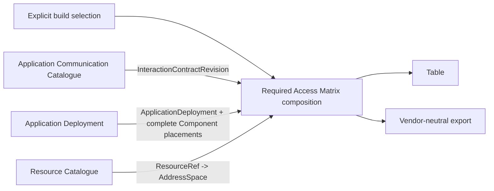

# NAPMS Context Map

Status: `current target`.

`strategic-model.md` owns context responsibilities and semantic meaning. This file owns target cross-context relationships, published contracts and composition boundaries.

Current implemented compatibility relationships are documented separately in `docs/architecture/current-architecture.md` and as-built engineering contracts. They do not redefine this target map.

## Relationship principles

- Cross-context references are opaque semantic references, not foreign keys into peer-owned persistence.
- A consumer owns the port through which it consumes another context/capability.
- A provider publishes semantic facts/projections but does not leak private Domain/persistence models.
- Derived workflows/compositions may combine several owners but acquire no authoritative truth merely by doing so.
- Unknown/unresolved owner data remains explicit; a consumer may not turn it into a convenient empty/default value unless its accepted contract explicitly defines that meaning.
- No Shared Kernel is accepted between target Bounded Contexts.

## Selected first implementation slice



One selection item is exactly:

```text
InteractionContractRevisionRef
+ sourceApplicationDeploymentRef
+ destinationApplicationDeploymentRef
```

The composition expands all applicable source placements × destination placements × traffic alternatives. It owns no independent ACC, AD, RC, authorization or enforcement truth.

The first slice does not infer which deployment pairs should communicate from Application identity, environment names or placement coincidence. Exact source/destination deployments are explicit input.

## Complete target relationship map

```mermaid
flowchart LR
    ACC[Application Communication Catalogue] -->|ApplicationRef / ComponentRef| AD[Application Deployment]
    RC[Resource Catalogue] -->|ResourceRef validity / existence| AD

    ACC -->|InteractionRef| BC[Business Connectivity]
    BC -->|Connectivity Need / business basis| AG[Access Governance]
    ACC -->|InteractionContractRevisionRef| AG
    AD -->|source/destination ApplicationDeployment + complete placements| AG
    RC -->|Resource -> ResponsibilityScopeRef| AG
    AM[Authority Management] -->|EffectiveAuthority| AG
    AG -->|AuthorizationGranted / AuthorizationWithdrawn| AP[Access Policy]

    AP --> RPM[Required Policy Materialization]
    ACC -->|exact InteractionContractRevision| RPM
    AD -->|complete placements| RPM
    RC -->|AddressSpace| RPM
    NEP[Network Enforcement Placement] -->|candidate target + policy locator| RPM
    RPM -->|TargetRequiredPolicy or Unresolved| APR[Access Policy Realization]

    DEV[Provider environment] --> PPI[Provider Policy Interpreter]
    TAE[Technical Access Evidence] -->|configured evidence when contract permits| PPI
    PPI -->|ConfiguredEffectivePolicySnapshot| APR
    APR -->|VerifiedChangeIntent| RENDER[Provider Policy Renderer]
    RENDER -->|TargetPolicyArtifact| NEO[Network Environment Operations]
    AM -->|EffectiveAuthority for mutation| NEO
    NEO -->|controlled mutation| DEV

    DEV --> ACQ[Technical Evidence Acquisition / Collectors]
    EXT[Import sources] --> ACQ
    ACQ -->|normalized source-qualified evidence| TAE
```



Arrows show semantic information/contract direction, not required synchronous transport, process boundaries or deployment topology.

## Relationship catalogue

| Provider / owner | Consumer | Published meaning | Consumer responsibility |
|---|---|---|---|
| ACC | AD | `ApplicationRef`, `ComponentRef` and component/application validity required for deployment correlation | AD owns deployment identity and placement truth; it does not copy ACC traffic semantics |
| RC | AD | opaque `ResourceRef` and Resource existence/lifecycle information needed to validate placement | AD owns placement; RC owns Resource identity and realization |
| ACC | BC | stable `InteractionRef` | BC owns why that interaction is needed, not its traffic realization |
| BC | AG | current Connectivity Need/business basis required by the governance use case | AG owns consent lifecycle, not Need identity |
| ACC | AG | exact immutable `InteractionContractRevisionRef` and its source/destination Component meaning | AG governs the exact revision; it does not edit ACC traffic |
| AD | AG | exact source/destination ApplicationDeployment identities plus complete current placements when obligation derivation needs them | AG derives governance obligations; it does not own placement |
| RC | AG | Resource-to-ResponsibilityScopeRef affiliation for applicable placed Resources | AG correlates obligation scopes; RC does not decide consent |
| AM | AG | `EffectiveAuthority(actor, action, scope, time)` with evidence | AG decides request/approval/withdrawal semantics; it does not infer authority itself |
| AG | AP | explicit current grant/withdrawal facts for one GovernedInteractionSubject | AP owns current Policy Rule truth and idempotency |
| AP | RPM | current authorized PolicyRule subjects | RPM expands authorization technically but does not alter it |
| ACC | RPM | exact immutable traffic alternatives for the Rule subject | RPM must preserve all applicable alternatives |
| AD | RPM | complete source/destination placement sets | RPM must preserve every applicable placement combination; unresolved != empty |
| RC | RPM | current effective AddressSpace for each Resource | RPM uses RC realization without redefining Resource identity |
| NEP | RPM | zero-or-more candidate Firewall/policy locators for each technical pair | RPM retains candidates; it does not invent a target winner |
| RPM | APR | complete `TargetRequiredPolicy` for one comparison scope, or explicit unresolved | APR does not reconstruct upstream ACC/AD/RC/AP/NEP semantics |
| PPI | APR | complete/source-neutral `ConfiguredEffectivePolicySnapshot` with scope, freshness/completeness/provenance/unsupported semantics | APR compares effective semantics and never parses provider syntax |
| APR | Renderer | verified source-neutral additive change intent plus target/base correlation | Renderer changes representation only, not meaning |
| Renderer | NEO | `TargetPolicyArtifact` semantically equivalent to verified intent | NEO executes under authority/preconditions; it does not redesign policy |
| AM | NEO | effective mutation authority | NEO fails closed when required authority is denied/unknown |
| Acquisition/Collectors | TAE | source-qualified normalized technical evidence | TAE owns recorded evidence semantics, not collection scheduling/transport |
| TAE | consumers/PPI | immutable normalized evidence/provenance | each consumer decides how that evidence contributes to its own question |

## ACC -> AD contract

ACC publishes stable application/component references and the semantic relation that one Component belongs to one Application.

AD references those identities without importing ACC private model types. A Component's placement may change without changing Component identity.

ACC does not publish Resource placement as part of Component identity.

## RC -> AD contract

AD placement stores opaque `ResourceRef` correlation. RC remains authoritative for Resource identity/lifecycle and AddressSpace.

A Resource address change therefore changes technical realization but not AD placement identity. AD does not copy addresses into placement truth as an authoritative substitute for RC.

## BC -> AG / ACC -> AG / AD -> AG / RC -> AG

AG combines distinct owner facts for one governance decision:

```text
Business basis: BC Connectivity Need
Traffic subject: ACC InteractionContractRevisionRef
Deployment subject: sourceApplicationDeploymentRef + destinationApplicationDeploymentRef
Obligation scope basis: AD placements + RC ResourceScopeAffiliation
Actor authority: AM EffectiveAuthority
```

These facts remain independently owned. AG records the consent/governance result rather than copying their authoritative lifecycle.

The exact governed subject excludes current Resource placements and AddressSpaces so ordinary scaling/address changes do not redefine the authorization identity. Placement/scope changes may still affect current approval obligations according to AG semantics.

## AG -> AP contract

AP reacts only to explicit accepted AG facts such as:

```text
AuthorizationGranted(subject, governanceProvenance)
AuthorizationWithdrawn(subject, governanceProvenance)
```

AP does not inspect Request/Approval internals to infer a grant. Pending or rejected governance does not create a deny Policy Rule.

## AP/ACC/AD/RC/NEP -> Required Policy Materialization

RPM is a composition boundary, not a peer context.

Input ownership remains:

```text
AP  -> authorized governed subject
ACC -> exact traffic contract revision
AD  -> complete source/destination placement sets
RC  -> current AddressSpaces
NEP -> candidate enforcement target/policy locators
```

Output is complete target-specific required permit space per comparison scope or explicit `Unresolved`.

The composition performs the full source placement × destination placement × traffic alternative expansion and carries provenance sufficient to explain each contributor.

An unresolved placement, missing required AddressSpace, unsupported address semantics or unresolved target correlation is not converted into a smaller apparently-complete policy.

## NEP relationship

NEP consumes technical source/destination pairs and network-placement evidence under its own contracts. It returns candidate enforcement relevance and policy/ACL locators.

NEP does not own:

- desired/authorized policy;
- configured-policy interpretation;
- required-vs-configured comparison;
- provider rendering;
- mutation execution.

Several NEP candidates remain several candidates until a separately accepted rule defines otherwise.

## Provider Policy Interpreter -> APR

PPI owns provider-native interpretation at the integration boundary. It may use provider source directly, TAE configured evidence under an explicit source contract, or both.

APR receives only source-neutral effective-policy semantics and explicit completeness/freshness/unsupported information. Native rule ordering, object groups, default action and provider syntax do not leak into APR Domain.

## APR -> Renderer -> NEO

APR owns semantic comparison/delta and source-neutral verified additive intent.

Renderer owns provider-specific representation and must prove/ensure semantic equivalence within its supported provider model.

NEO owns controlled operational mutation. NEO never recomputes APR intent or uses provider credentials/access as authority evidence.

A later post-change observation flows back through acquisition/interpretation/comparison; NEO's successful transport result does not directly set APR to `Realized`.

## Technical Evidence Acquisition -> TAE

Source acquisition owns:

- source transport/client mechanics;
- credentials;
- polling/scheduling/retry mechanics;
- provider/import parsing before the TAE boundary.

TAE owns:

- stable evidence-set/entry identity;
- source/capture/scope qualification;
- normalized technical predicate/action facts;
- source-time versus recorded-time meaning;
- immutable evidence history/provenance.

Acquisition and NEO may share lower-level technical clients when Architecture justifies it, but neither may use that sharing to merge their semantic ports/responsibilities.

## Required Access Matrix relation to the target map

The selected first implementation slice intentionally bypasses BC/AG/AP/NEP and all configured-state realization contexts:

```text
explicit deployment-level build selection
+ ACC
+ AD
+ RC
    -> Required Access Matrix
```

This is safe because its output is named and defined as pre-authorization technical connectivity, not Access Policy or TargetRequiredPolicy.

A future AP-backed materialization path can supply authorized governed subjects into downstream RPM without changing ACC/AD/RC ownership.

## As-built compatibility map

Current runtime may still use:

- `Connectivity Requirement` and `Connectivity Decision` modules;
- ACC compatibility `ComponentDeployment`, `DeploymentResourceBinding`, `DirectedInteractionIdentity` and DCS projection;
- existing effective-policy/export/read compositions;
- older APR/Realization runtime contracts.

Those current implementation relationships are documented in `docs/architecture/current-architecture.md`, as-built requirements, current ADRs and engineering/API contracts. They are not additional target arrows in this Context Map.
