# NAPMS Context Map

Status: `S2 global Strategic DDD convergence accepted for current target scope`.

Date: 2026-09-14.

This is the canonical strategic relationship map for the current NAPMS target. It defines semantic participants, ownership direction and public cross-boundary contracts. It does not define services, deployments, databases, transports or package dependencies.

`docs/domain/strategic-model.md` remains the canonical responsibility/boundary summary. `docs/domain/strategic-model.json` is the machine-readable projection of participants and material relationships. Context-local Tactical DDD remains owned by the corresponding context artifacts.

## Strategic participants

### Bounded Contexts

| Bounded Context | Authoritative semantic responsibility |
|---|---|
| **Business Connectivity** | Business Process, Connectivity Need and business justification/attribution |
| **Access Governance** | Access Request history, bilateral approval obligations/current consent, grant/withdrawal provenance |
| **Access Policy** | authoritative current Policy Rule truth and effective authorized-policy projection |
| **Authority Management** | effective actor/action/scope/time authority and role/group/scope assignment semantics |
| **Resource Catalogue** | Resource/ResourceEndpoint identity, current/historical corporate-visible realization, Resource Scope Affiliation and Resource Responsibility |
| **Application Communication Catalogue** | Application/Component/ComponentDeployment/Interaction identity and immutable interaction traffic contract |
| **Network Enforcement Placement** | candidate Firewall relevance and applicable policy/ACL locators |
| **Technical Access Evidence** | immutable source-qualified normalized technical evidence with provenance/time/source scope |
| **Access Policy Realization** | source-neutral required-vs-configured effective-policy assessment, semantic delta, vendor-neutral change design and proposed-result verification |
| **Network Environment Operations** | controlled provider/device mutation attempt identity, authority admission, concurrency/preconditions, outcome and execution provenance |

`Connectivity Requirements` and `Connectivity Decision` are legacy/current-state boundaries only and are not current target Bounded Contexts.

### Non-peer strategic participants

| Participant | Kind | Responsibility |
|---|---|---|
| **Required Policy Materialization** | derived composition | derive normalized required technical predicates and `TargetRequiredPolicy` from published Access Policy, ACC, Resource Catalogue and NEP contracts; unresolved input remains explicit |
| **Provider Policy Interpreter** | integration/adapter capability | translate provider-native configured policy into a source-neutral `ConfiguredEffectivePolicySnapshot` with scope/completeness/provenance/unsupported semantics |
| **Provider Policy Renderer** | integration/adapter capability | translate APR-verified vendor-neutral intent into a semantically equivalent `TargetPolicyArtifact` or fail closed |
| **Scoped Connectivity Inventory** | application/read composition | compose owner-facing views from context-owned public facts without becoming a source of truth |
| **Connectivity Impact / technical analysis compositions** | application/read/analysis composition | combine accepted context facts/evidence for a concrete analysis without becoming a peer semantic owner |

These participants may have application identity or implementation state, but they do not become Bounded Contexts merely because they orchestrate several contexts.

### External seams

- **Provider / network-device environment** — routing/configuration/observation/mutation source and target. Provider-native meaning is translated through explicit adapters; it is not NAPMS domain truth by itself.
- **Optional external identity provider** — may authenticate a source-qualified external subject and map it to one NAPMS Actor; it never grants NAPMS business authority directly.
- **Optional enterprise source systems** — future sources for Authority Management, ACC, Resource Catalogue or organizational-responsibility references. They terminate at context-owned import/projection seams and do not become shared mutable domain models.

The current supported product remains local-first. No concrete external enterprise provider, synchronization protocol or organization hierarchy is required until a future accepted requirement selects one.

## Global relationship policy

Unless an accepted context contract says otherwise:

- the upstream semantic owner publishes the smallest stable public meaning needed by the consumer;
- consumers keep peer-private aggregates/entities/storage invisible and use opaque references or consumer-owned ports/translations;
- no cross-context database foreign key or shared mutable model is a semantic contract;
- a shared reference such as `ResponsibilityScope` is correlation, not a shared lifecycle/aggregate;
- `Unknown`, incomplete, ambiguous and unresolved states remain explicit where converting them to absence/success would change meaning;
- temporal meaning (`current`, `asOf`, snapshot/evidence time) crosses a boundary explicitly when it affects the consumer decision;
- provenance crosses a boundary when the downstream result must explain or audit the upstream fact;
- provider-native policy syntax is isolated by the Provider Policy Interpreter/Renderer anti-corruption boundaries;
- no Shared Kernel is accepted between current target Bounded Contexts.

## Core governance and realization flow

This diagram is an intentionally compact end-to-end view of the main governance-to-realization path. It is **not** the exhaustive Context Map. Material relationships that are omitted for readability remain canonical in `Public semantic contracts by edge` below and in `docs/domain/strategic-model.json`.

```mermaid
flowchart LR
    EXTORG[Optional enterprise sources] -. optional refs/import .-> BC[Business Connectivity]
    EXTORG -. optional imports .-> AM[Authority Management]
    EXTORG -. optional imports .-> RC[Resource Catalogue]
    EXTORG -. optional imports .-> ACC[Application Communication Catalogue]

    RC -->|opaque ResourceRef| ACC
    ACC -->|InteractionRef| BC
    BC -->|ConnectivityNeed summary| AG[Access Governance]
    ACC -->|DirectedInteractionIdentity| AG
    RC -->|effective Resource Scope Affiliation| AG
    AM -->|EffectiveAuthority| AG
    AG -->|AuthorizationGranted / Withdrawn| AP[Access Policy]

    AP --> RPM[Required Policy Materialization]
    ACC --> RPM
    RC --> RPM
    NEP[Network Enforcement Placement] --> RPM
    RPM -->|TargetRequiredPolicy| APR[Access Policy Realization]

    DEV[Provider / network-device environment] --> PPI[Provider Policy Interpreter]
    PPI -->|ConfiguredEffectivePolicySnapshot| APR
    APR -->|VerifiedChangeIntent| PPR[Provider Policy Renderer]
    PPR -->|TargetPolicyArtifact| NEO[Network Environment Operations]
    AM -->|mutation EffectiveAuthority| NEO
    NEO -->|controlled mutation| DEV
    DEV -->|subsequent state| PPI

    DEV -->|source-qualified capture| TAE[Technical Access Evidence]
```



The arrows show semantic ownership/data-flow direction, not synchronous transport or deployment topology. In particular, TAE is shown as an independent evidence owner: downstream interpreters/consumers may reference TAE evidence, but TAE is not required to mediate provider acquisition and does not publish APR's configured-effective-policy view. Authority Management also has protected consumers beyond the two arrows shown here; those material relationships are specified by the authority contract below and in the machine-readable relationship set.

## Public semantic contracts by edge

### Application Communication Catalogue -> Business Connectivity

**Purpose:** let a Connectivity Need refer to application-semantic communication without importing ACC internals.

Contract:

```text
InteractionRef / InteractionContractRevisionRef
```

Business Connectivity treats the reference as opaque ACC identity and does not replace it with IP/Resource realization.

### Business Connectivity -> Access Governance

**Purpose:** establish the business basis for a deliberate Access Request without making Need equal permission.

Contract conceptually includes:

```text
ConnectivityNeedRef
BusinessProcessRef
required InteractionRef
current/applicable justification status
human-explainable basis
```

`Unknown/Incomplete` justification status must not become `NoneKnown`. Access Governance preserves the historical basis used by a Request and owns the authorization decision/history.

### Resource Catalogue -> Application Communication Catalogue

**Purpose:** bind one ComponentDeployment to exactly one access-domain Resource for its lifetime.

Contract:

```text
opaque ResourceRef
```

ACC owns the binding; Resource Catalogue owns Resource/Endpoint/address truth. Moving a Component to another Resource creates another ComponentDeployment rather than silently rebinding authorization identity.

### Application Communication Catalogue -> Access Governance

**Purpose:** identify the exact deployed interaction being governed.

Published contract:

```text
DirectedInteractionIdentity {
    sourceComponentDeploymentRef
    destinationComponentDeploymentRef
    interactionContractRevisionRef
}
```

Access Governance does not own ComponentDeployment/Interaction lifecycle and must not authorize only a private subset of an atomic Interaction contract revision.

### Resource Catalogue -> Access Governance

**Purpose:** supply the responsibility-scope facts from which source/destination governance obligations can be correlated.

Contract conceptually is:

```text
ResourceRef
+ logicalTime
-> effective ResourceScopeAffiliation[]
   with validity/provenance
```

A ComponentDeployment's `ResourceRef` comes from ACC. Resource Catalogue owns which scope affiliations are effective. Access Governance owns how an approval obligation uses those facts; Authority Management owns whether an Actor may perform the approval/revoke action for the selected scope.

Zero, overlapping or otherwise unresolved applicable affiliations must remain explicit. Resource owner/administrator/contact metadata must never be substituted for approval authority. The exact product policy for choosing among overlapping applicable scopes remains an Access Governance requirement/Tactical question and does not move ownership into Resource Catalogue or Authority Management.

### Authority Management -> protected consumers

**Purpose:** answer whether an Actor may perform a specific domain action for a stable scope at a logical/effective time.

Public meaning:

```text
ActorRef
+ Action
+ ResponsibilityScopeRef
+ effectiveTime
-> admitted / denied / unknown-or-ambiguous
+ sufficient authority provenance
```

Material current consumers include Access Governance approval/revocation/request actions, Resource/ACC curation actions, owner-workspace read actions and Network Environment Operations mutation admission. Consumers own the decision made after authority admission; they do not inspect role/group internals or infer authority from ownership/contact data.

### Access Governance -> Access Policy

**Purpose:** publish current semantic authorization changes without exporting request workflow internals.

Contract:

```text
AuthorizationGranted(subject, provenance)
AuthorizationWithdrawn(subject, provenance)
```

Pending/rejected Requests do not create semantic deny Policy Rules. Historical approved Requests cannot silently restore authorization after a current withdrawal.

### Access Policy -> Required Policy Materialization

**Purpose:** provide current effective semantic authorization to technical materialization.

Contract: effective Policy Rules with subject/provenance sufficient to resolve the authorized deployed interaction. Materialization may derive technical predicates but may not re-decide authorization.

### Application Communication Catalogue -> Required Policy Materialization

**Purpose:** resolve the authorized semantic subject to its concrete deployments, Resource references and complete immutable traffic contract.

Materialization consumes only ACC public contracts. It must not invent traffic selectors or inspect ACC persistence.

### Resource Catalogue -> Required Policy Materialization

**Purpose:** resolve each referenced Resource to current ResourceEndpoint/corporate-visible address realization at the selected logical time.

Missing realization is `unresolved`; it is not an empty required policy.

### Network Enforcement Placement -> Required Policy Materialization

**Purpose:** identify every candidate Firewall and applicable policy/ACL locator for each technical source/destination pair.

Contract conceptually:

```text
TrafficPair
-> FirewallCandidate[]
   -> AccessListLocator[]
```

Candidate membership means relevance-to-inspect, not a proven end-to-end path. Materialization must not reinterpret routing/override evidence. A candidate target without a comparable locator remains unresolved.

NEP-owned target identity/locator references remain opaque through downstream `TargetRequiredPolicy`, rendering and execution. Network Environment Operations does not re-decide placement.

### Required Policy Materialization -> Access Policy Realization

**Purpose:** publish a comparable target-specific required effective policy.

Contract conceptually:

```text
TargetRequiredPolicy {
    targetRef
    policyLocator
    required effective normalized predicates
    contributing PolicyRule refs
    input freshness/provenance refs
    logical/effective time
}
```

Only successfully comparable materializations enter APR. `unresolved` is a separate upstream outcome, not `missing` or an empty policy.

### Provider / network-device environment -> Provider Policy Interpreter

**Purpose:** obtain provider-native configured policy for an explicit comparison scope and interpret its effective semantics exactly for the supported slice.

The provider/native representation is external evidence/input, not APR or TAE domain truth. Unsupported semantics fail closed.

### Provider Policy Interpreter -> Access Policy Realization

Contract:

```text
ConfiguredEffectivePolicySnapshot {
    targetRef
    policyLocator / comparisonScope
    effectivePermitSpace
    source/evidence refs
    evidence/effective time
    completeness: Complete | Incomplete | Unknown
    interpreter identity/version
    unsupportedSemantics[]
}
```

APR may reach a complete realization conclusion only from comparable complete semantics. `Incomplete | Unknown` never means empty configured policy.

Technical Access Evidence may preserve source-qualified captures referenced by an interpreter, but it does not choose APR currentness/completeness or become the configured-policy publisher.

### Access Policy Realization -> Provider Policy Renderer

**Purpose:** translate already verified source-neutral intent into a provider representation without changing policy meaning.

Contract:

```text
VerifiedChangeIntent
+ target/provider capability input
+ base target revision/correlation
```

APR owns the verified semantic intent. The renderer owns representation translation only.

### Provider Policy Renderer -> Network Environment Operations

Contract:

```text
TargetPolicyArtifact
```

The artifact carries enough target/base/integrity/provenance correlation for controlled execution. Rendering must establish semantic equivalence for supported provider semantics or fail closed; NEO does not repair or reinterpret it.

### Authority Management -> Network Environment Operations

Mutation requires independent action-specific authority admission for the target/scope. Read/acquisition authority does not imply mutation authority. Denied/unknown/ambiguous admission fails closed before apply.

### Network Environment Operations -> provider / network-device environment

**Purpose:** execute one controlled target mutation attempt with stable operation identity, preconditions/concurrency protection and explicit outcome/provenance.

`Applied` is not convergence proof. Subsequent provider state is interpreted again and compared by APR.

### External/source adapters -> Technical Access Evidence

**Purpose:** preserve immutable source-qualified normalized technical evidence.

Contract includes source namespace/reference, source-defined scope, capture reference, evidence time and normalized entries. TAE does not claim universal currentness, completeness or authorization. Any downstream consumer requiring those properties must establish them in its own source/consumer contract.

## Responsibility Scope correlation

`ResponsibilityScope` is currently a stable reference value, not a separate Bounded Context or aggregate.

Two independent truths may use the same reference:

```text
Resource Catalogue:
Resource --ResourceScopeAffiliation--> ResponsibilityScopeRef

Authority Management:
Actor --EffectiveAuthority(action)--> ResponsibilityScopeRef
```

The shared reference correlates those truths; it does not make Resource affiliation equal actor authority and does not imply a shared lifecycle.

Access Governance may use the effective Resource affiliations to identify the relevant side scope and then ask Authority Management about the Actor/action/scope/time admission. It must not derive either fact from the other.

## External organization/responsibility boundary

Current G1 requires Business Process organizational responsibility but explicitly does not equate an external organizational unit with a NAPMS Responsibility Scope. The current local-first model therefore needs only source-neutral organization/responsibility references sufficient for explanation/governance correlation.

A concrete enterprise organization registry, hierarchy, synchronization protocol, completeness/deletion model or mapping to Responsibility Scope is not current product behavior. If a future requirement selects such a source, it terminates at a Business Connectivity-owned import/reference seam and cannot silently grant Authority Management permissions or redefine Process identity.

This closes the strategic ownership/boundary question without inventing a provider-specific integration contract.

## Deferred behavior that does not block this Context Map

The following questions remain real but do not currently change strategic ownership/boundaries/contracts:

- whether a later Resource Scope Affiliation/responsibility change should warn, trigger reapproval, or automatically withdraw existing Access Governance consent;
- how Access Governance selects one applicable approval scope when several Resource Scope Affiliations are simultaneously valid;
- exact Process organization-reference shape once a concrete external organization source or editing workflow is required.

The first two are product behavior/Access Governance Tactical concerns. If a selected use case requires a policy not already accepted by G1, route to S1 rather than inventing it in Strategic DDD. The third is an optional-source detail and re-enters Strategic DDD only if a concrete external source changes ownership or language boundaries.

## Global boundary-challenge result

The 2026-09-14 global pass challenged every current target participant and material edge against ownership, private-model leakage, temporal/unknown semantics and external seams.

Closed findings:

- **P1:** Network Environment Operations had an accepted independent semantic lifecycle but was omitted from the canonical target BC list; it is a target Bounded Context.
- **P1:** Access Governance depended on governance scope facts without an explicit Resource Catalogue relationship; `ResourceScopeAffiliation` is now the explicit upstream fact while obligation/scope-selection policy remains Access Governance-owned.
- **P1:** relationship truth was distributed across strategic/tactical/ADR artifacts without one canonical Context Map; this document is that map.
- **P1:** machine-readable strategic `external_seams` was empty despite accepted provider and optional enterprise seams; the strategic model is aligned with this map.
- **P2:** legacy Requirement/Decision terminology in the canonical Resource role summary could suggest obsolete governance ownership; current target wording is aligned with Business Connectivity / Access Governance / Access Policy.
- **P2:** the overview Mermaid previously looked like an exhaustive Context Map while intentionally omitting some material consumers; it is now explicitly scoped as the compact governance/realization flow, with exhaustive material edges delegated to the semantic-contract section and machine-readable projection.
- **P2:** TAE's visual position could imply a required mediation path; the diagram annotation now makes its independent evidence-owner role explicit.

No remaining P0/P1 ownership, context-boundary or cross-context-contract contradiction is known for the current target scope after these corrections.

This is a **Strategic DDD convergence PASS**, not a blanket `G2 PASS` for every context. S2 Tactical DDD remains required where identity/lifecycle/invariant questions are still dirty, notably APR and NEP revalidation slices.
