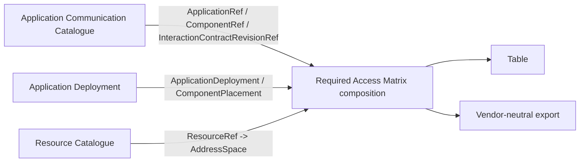
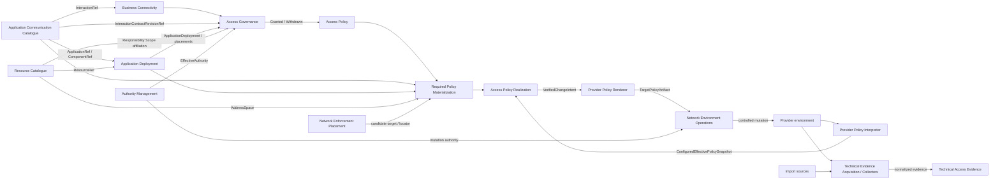

# NAPMS Context Map

Status: `current target`.

`strategic-model.md` owns responsibilities. This file owns current cross-context relationships.

## Selected first implementation slice



Selection input:

```text
InteractionContractRevisionRef
+ sourceApplicationDeploymentRef
+ destinationApplicationDeploymentRef
```

The composition expands all applicable source placements × destination placements × traffic alternatives. It returns a complete matrix or explicit `Unresolved`. It owns no independent ACC, AD, RC or authorization truth.

## Complete target relationship map



Arrows show semantic ownership/data flow, not synchronous transport or deployment topology.

## Core public contracts

**ACC -> AD:** stable `ApplicationRef / ComponentRef`.

**RC -> AD:** opaque `ResourceRef`; AD owns placement, RC owns Resource realization.

**ACC + AD -> AG:** governed subject is exact `InteractionContractRevisionRef + sourceApplicationDeploymentRef + destinationApplicationDeploymentRef`.

**AM -> protected actions:** `ActorRef + ActionRef + ResponsibilityScopeRef + effectiveTime -> EffectiveAuthority`.

**AG -> AP:** explicit authorization granted/withdrawn facts; AP does not reconstruct bilateral governance.

**AD -> materialization:** complete applicable placement set or unresolved.

**RC -> materialization:** current effective `AddressSpace = HostAddress | Prefix` or unresolved.

**NEP -> Required Policy Materialization:** zero or more candidate firewall/policy locators; candidates express relevance, not proven end-to-end traversal.

**RPM -> APR:** complete target-specific required policy for a comparison scope or unresolved.

**PPI -> APR:** complete/configurable `ConfiguredEffectivePolicySnapshot` with freshness/completeness/unsupported semantics.

**APR -> Renderer:** verified source-neutral additive intent only when comparison is comparable.

**Renderer -> NEO:** semantically equivalent provider-specific artifact with target/base correlation.

**Acquisition -> TAE:** source-qualified normalized technical evidence; collection mechanics remain outside TAE.
