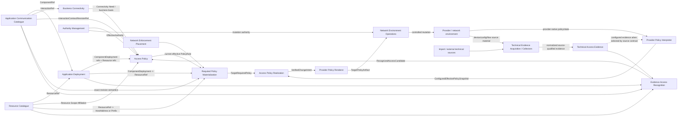

# NAPMS Context Map

Status: `S2 affected relationship map converged 2026-09-16; dependent Tactical DDD pending`.

Date: 2026-09-16.

This is the canonical strategic relationship map. `strategic-model.md` owns responsibilities/boundaries; `strategic-model.json` is the machine-readable projection.

## Core relationship map



Arrows show semantic ownership/data flow, not synchronous transport or deployment topology. No Shared Kernel is accepted.

`Access Governance` is not a separate target Bounded Context in the revalidated model. Its proposal/approval/withdrawal responsibilities are part of the Access Policy lifecycle.

Provider Policy Interpreter, Provider Policy Renderer and Technical Evidence Acquisition/Collectors are integration/application capabilities. Required Policy Materialization and Evidence Access Recognition are non-peer compositions.

## Affected public contracts

### ACC -> Business Connectivity

Business Connectivity references stable `InteractionRef` as application-semantic business need. A Need is not pinned to one concrete Component Deployment or immutable traffic revision.

### ACC -> Application Deployment

Application Deployment consumes opaque `ComponentRef`. ACC remains owner of Application/Component semantics.

A Component Deployment can only reference an existing Component. Application Deployment does not copy Interaction or revision semantics.

### RC -> Application Deployment

Application Deployment consumes opaque `ResourceRef`. RC remains owner of Resource identity, lifecycle, AddressSpace and responsibility/scope facts.

For the first MVP one `ComponentDeploymentRef` resolves to exactly one `ComponentRef` and one `ResourceRef`.

```text
ComponentDeploymentRef
-> ComponentRef
-> ResourceRef
```

Deploying the same Component on another Resource produces another `ComponentDeploymentRef`.

### ACC + Application Deployment -> Access Policy

One concrete policy connection uses:

```text
sourceComponentDeploymentRef
+ destinationComponentDeploymentRef
+ revisionRef
```

The directed Component Deployment pair identifies the concrete connection. `revisionRef` identifies the exact proposed/current traffic semantics but is not itself the connection identity.

Access Policy resolves the revision through ACC and verifies:

```text
source ComponentDeployment.ComponentRef
    == revision.Interaction.sourceComponentRef

destination ComponentDeployment.ComponentRef
    == revision.Interaction.destinationComponentRef
```

Because an Interaction is intra-Application, this validation also prevents cross-Application policy connections.

No duplicate `InteractionRef` is required in the policy contract solely to recover the owning Interaction of an exact revision.

### Application Deployment -> Access Policy

Application Deployment publishes only the concrete endpoint facts needed by the lifecycle:

```text
ComponentDeploymentRef
-> ComponentRef
-> ResourceRef
| unresolved
```

The first MVP has no whole-Application deployment selection or placement-set expansion in access governance.

A Resource address change does not replace ComponentDeployment identity. A different Component deployment on a different Resource is a different policy endpoint.

### RC -> Access Policy

For approval-obligation resolution:

```text
ResourceRef + logicalTime
-> effective ResourceScopeAffiliation[] with validity/provenance
```

Access Policy owns how these facts establish source/destination approval obligations.

For the MVP, each governance side must resolve to exactly one distinct applicable Responsibility Scope. Zero or several fail closed.

A material change of applicable obligations may make current authorization cease to be effective; historical decisions do not silently satisfy changed obligations.

### AM -> Access Policy

AM evaluates effective authority for an exact:

```text
ActorRef + ActionRef + ResponsibilityScopeRef + effectiveTime
```

`Denied` and `Unknown` fail closed for protected actions. Resource responsibility/contact metadata does not grant authority.

Access Policy preserves the authority evidence/basis used for historical decisions without copying AM private role/group models.

### Business Connectivity -> Access Policy

A deliberate access change submission requires a Process-backed Connectivity Need/business basis.

Published meaning required by Access Policy includes stable references sufficient to explain the business basis, including the relevant `InteractionRef` and current/applicable justification status.

Access Policy does not convert Need existence into authorization. A Need may outlive one Component Deployment pair or revision.

Evidence-derived recognition may create a candidate before Need attribution; that candidate cannot bypass the business-basis requirement for deliberate governance submission.

### Access Policy internal lifecycle boundary

No cross-context AG -> AP handoff exists in the target model.

Within Access Policy, these truths remain distinct:

```text
PolicyRule identity / concrete endpoint pair
current effective revision (optional)
pending/rejected/approved rule-change attempts
bilateral approval decisions and provenance
withdrawal history
```

A pending/rejected revision change never overwrites the current effective revision. An accepted change may update the effective revision for the same Policy Rule.

### Access Policy -> RPM

Access Policy publishes current effective Policy Rules only, with opaque `PolicyRuleRef` provenance and enough public meaning to identify:

```text
sourceComponentDeploymentRef
destinationComponentDeploymentRef
revisionRef
```

Historical/pending/rejected changes do not enter current required-policy materialization.

### ACC -> RPM

`InteractionContractRevisionRef -> complete immutable traffic contract + endpoint ComponentRefs`.

ACC does not resolve deployments or Resources.

### Application Deployment -> RPM

```text
ComponentDeploymentRef
-> ComponentRef
-> ResourceRef
| unresolved
```

Each effective Policy Rule already names one concrete source and destination Component Deployment. RPM does not perform replica/placement Cartesian expansion.

### RC -> RPM

For current scope:

```text
ResourceRef + logicalTime
-> CurrentResourceRealization {
     addressSpace? : HostAddress | Prefix
     asOf
     resolution/completeness
     provenance/freshness
   }
```

One Resource has at most one effective AddressSpace at a logical time. Missing realization is unresolved, not an empty address set. Prefixes are first-class and are not expanded into hosts.

### NEP -> RPM

```text
TrafficPair
-> FirewallCandidate[]
   firewallId
   accessListNames[]
   freshness metadata
```

Candidate membership is relevance-to-inspect/affect, not a proven path. Multiple candidates are preserved.

For the first end-to-end target-specific path, RPM calls this edge only with HostAddress-to-HostAddress pairs. Prefix yields unresolved until Prefix-aware NEP semantics are accepted.

### RPM -> APR

RPM groups normalized required permit predicates by:

```text
ComparisonScope = firewallId + accessListName
```

and publishes complete `TargetRequiredPolicy` results carrying contributing `PolicyRuleRef` provenance. Missing/incomplete upstream evidence is `unresolved`, never empty policy.

### Technical Evidence Acquisition / Collectors -> TAE

Acquisition/collector capabilities initiate source collection outside TAE and publish faithfully normalized source-qualified evidence into TAE.

TAE owns evidence meaning/invariants, not polling cadence, credentials, retries or source transport.

### TAE + RC + Application Deployment + ACC -> Evidence Access Recognition

Evidence Access Recognition is a non-authoritative composition.

It may correlate:

```text
TAE source/destination address + protocol/ports
-> RC Resource correlation
-> Application Deployment ComponentDeployment correlation
-> ACC exact Component/Interaction/revision match
-> RecognizedAccessCandidate | unresolved/ambiguous
```

It must fail closed on ambiguous/missing correlation. It cannot manufacture a Resource, Component Deployment, Interaction revision, business Need or authorization.

### Evidence Access Recognition -> Access Policy

A recognized candidate may initiate the same proposal/change lifecycle used for manually proposed access.

The candidate carries evidence provenance sufficient to explain why it was proposed. Access Policy remains the owner of whether the candidate becomes a submitted change, receives approvals or affects current policy.

### TAE -> Provider Policy Interpreter

Configured evidence may be consumed by PPI when selected by an explicit source contract. TAE does not select globally current/complete configured policy.

### Provider Policy Interpreter -> APR

PPI publishes `ConfiguredEffectivePolicySnapshot` for the exact ComparisonScope with explicit completeness, freshness/provenance and unsupported-semantics information. APR does not parse raw provider syntax.

### APR -> Provider Policy Renderer -> NEO

APR owns exact source-neutral comparison and accepted additive `ENSURE-PERMIT` intent. Provider renderer publishes executable target representation only when semantic equivalence can be proven. NEO owns controlled mutation with authority/precondition/outcome semantics.

Execution success is not final semantic convergence proof.

## Application Deployment boundary decision

Boundary Challenge: **PASS for the affected MVP behavior**.

```text
ComponentDeployment {
    ComponentDeploymentId
    ComponentRef
    ResourceRef
}
```

Strategic meaning:

- one concrete deployed Component instance is one Component Deployment;
- one Component Deployment references exactly one Resource in the first MVP;
- deploying the same Component to another Resource creates another Component Deployment;
- no whole-Application deployment identity is needed by the target policy lifecycle;
- Resource address realization remains RC truth;
- exact identity/lifecycle operations are Tactical DDD concerns.

The same term may exist in as-built ACC compatibility contracts with different ownership/semantics. Those contracts remain as-built reconstruction truth and do not redefine this target Application Deployment concept.

## Access Policy boundary decision

Boundary Challenge: **PASS for merging the former AG/AP target split**.

The former split had two current-authorization owners:

```text
Access Governance.GovernedAuthorization.effectiveGrant
    -> AuthorizationGranted / Withdrawn
    -> Access Policy.PolicyRule current authorization
```

After G1 revalidation, AP adds no independent authorization decision: the approved/rejected/withdrawn proposal lifecycle is exactly what determines the Rule's current effective revision/state.

Keeping both BCs would duplicate the same current semantic truth and require identity translation/handoff without an independent lifecycle reason. The target therefore uses one Access Policy BC with governance as an internal domain capability.

Business Connectivity and Authority Management remain separate because their identities/lifecycles are independently meaningful.

## Deferred affected-edge extensions

- generalized approval behavior for several simultaneous Responsibility Scopes on one side;
- nested groups, role inheritance, explicit deny/ABAC authority rules;
- whether several different Component Deployments may share one Resource;
- richer ComponentDeployment runtime/container/pod lifecycle/history;
- Prefix-aware NEP TrafficPair semantics;
- managed-policy ownership/removal semantics for APR `excess`;
- several simultaneous Resource addresses/interfaces, endpoint purpose, VIP and deployment-specific exposure;
- richer ACC revision workflow/version presentation;
- concrete acquisition scheduling/polling and shared provider/device access realization (S3).

## Convergence result

The affected Strategic relationships are coherent with the revalidated G1 behavior. Dependent Tactical DDD remains DIRTY until Policy Rule/change lifecycle, ComponentDeployment identity, recognition candidate handoff and related invariants are revalidated.

No implementation authorization is implied by this map.
