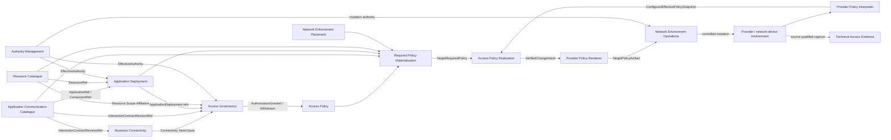

# NAPMS Context Map

Status: `S2 affected-edge convergence accepted for Application Deployment; named AG behavior remains S1-open`.

Date: 2026-09-15.

This is the canonical strategic relationship map for the current NAPMS target. It defines semantic participants, ownership direction and public cross-boundary contracts. It does not define services, databases, transports or package dependencies. `strategic-model.md` is canonical for responsibilities/boundaries; `strategic-model.json` is its machine-readable projection.

## Strategic participants

### Bounded Contexts

| Bounded Context | Authoritative semantic responsibility |
|---|---|
| **Business Connectivity (BC)** | Business Process, Connectivity Need and business justification/attribution |
| **Access Governance (AG)** | Access Request history, bilateral approval obligations/current consent, grant/withdrawal provenance |
| **Access Policy (AP)** | authoritative current Policy Rule truth and effective authorized-policy projection |
| **Authority Management (AM)** | effective actor/action/scope/time authority and role/group/scope assignment semantics |
| **Resource Catalogue (RC)** | Resource identity/lifecycle, technical realization, Resource Scope Affiliation and Resource Responsibility |
| **Application Communication Catalogue (ACC)** | Application/Component/Interaction identity and immutable interaction traffic contract |
| **Application Deployment (AD)** | ApplicationDeployment identity/lifecycle and Component-to-Resource placement truth |
| **Network Enforcement Placement (NEP)** | candidate Firewall relevance and applicable policy/ACL locators |
| **Technical Access Evidence (TAE)** | immutable source-qualified normalized technical evidence with provenance/time/source scope |
| **Access Policy Realization (APR)** | source-neutral required-vs-configured assessment, semantic delta, vendor-neutral change design and proposed-result verification |
| **Network Environment Operations (NEO)** | controlled provider/device mutation identity, authority admission, concurrency/preconditions, outcome and execution provenance |

`Connectivity Requirements` and `Connectivity Decision` are legacy/current-state boundaries only.

### Non-peer participants

- **Required Policy Materialization (RPM)** — derived composition of AP authorization, ACC traffic semantics, AD placements, RC technical realization and NEP placement into target-specific required policy.
- **Provider Policy Interpreter (PPI)** — provider-native configured-policy anti-corruption/interpretation capability.
- **Provider Policy Renderer (PPR)** — provider-native rendering capability for APR-verified intent.
- **Scoped Connectivity Inventory** and **Connectivity Impact / technical analysis compositions** — read/application compositions, not semantic owners.

### External seams

Provider/network-device environment, optional external identity provider, and optional enterprise source systems remain explicit external seams.

## Global relationship policy

- Upstream owners publish the smallest stable public meaning needed by consumers.
- Consumers do not depend on peer-private entities, aggregates or storage.
- Cross-context references are opaque semantic identities, not shared lifecycles or database foreign keys.
- Unknown, incomplete, ambiguous and unresolved states remain explicit where absence would change meaning.
- Temporal meaning and provenance cross boundaries when downstream decisions depend on them.
- No Shared Kernel is accepted between target BCs.
- Semantic ownership does not require remote computation; consumer-local rebuildable projections may be introduced later without becoming authoritative truth.

## Core governance and realization flow



Arrows show semantic ownership/data flow, not synchronous transport or deployment topology.

## Public semantic contracts by affected edge

### ACC -> AD

```text
ApplicationRef
ComponentRef
```

ACC owns Application/Component identity. AD owns deployment and placement lifecycle.

### RC -> AD

```text
opaque ResourceRef
```

AD owns Component-to-Resource placement; RC retains Resource truth. The former `RC -> ACC ResourceRef` deployment-binding edge is superseded.

### ACC -> BC

```text
InteractionRef / InteractionContractRevisionRef
```

Connectivity Need remains application-semantic and does not import deployment/address realization.

### BC -> AG

Conceptually:

```text
ConnectivityNeedRef
BusinessProcessRef
InteractionContractRevisionRef
current/applicable justification status
human-explainable basis
```

Need is business basis, not permission.

### ACC + AD -> AG

The governed subject is conceptually:

```text
GovernedInteractionSubject {
    interactionContractRevisionRef       // ACC
    sourceApplicationDeploymentRef       // AD
    destinationApplicationDeploymentRef  // AD
}
```

This supersedes the former ACC-owned `DirectedInteractionIdentity` containing ComponentDeployment refs. Scaling, ordinary placement replacement, Resource replacement and address changes do not by themselves redefine subject identity. Subject identity does not imply that existing consent remains valid after approval obligations change.

### RC -> AG

```text
ResourceRef
+ logicalTime
-> effective ResourceScopeAffiliation[]
   with validity/provenance
```

AG owns how current placement/resource scope facts establish source/destination approval obligations. AM owns actor authority for selected scope/action/time. Zero, multiple or ambiguous applicable scopes remain explicit.

### AM -> protected consumers

```text
ActorRef
+ Action
+ ResponsibilityScopeRef
+ effectiveTime
-> admitted / denied / unknown-or-ambiguous
+ authority provenance
```

Material consumers include AG, RC, ACC, AD and NEO. Consumer decisions remain consumer-owned.

### AG -> AP

```text
AuthorizationGranted(subject, provenance)
AuthorizationWithdrawn(subject, provenance)
```

Pending/rejected Requests do not create deny Policy Rules. Event identity/version/order/idempotency semantics remain to be hardened with Tactical AP/AG work.

### AP -> RPM

Effective Policy Rules with governed subject/provenance. RPM may materialize but may not re-decide authorization.

### ACC -> RPM

```text
InteractionContractRevisionRef
+ complete immutable traffic contract
```

ACC no longer resolves deployments or Resource references for RPM.

### AD -> RPM

Conceptually:

```text
ApplicationDeploymentRef
+ ComponentRef
+ logicalTime
-> applicable ComponentPlacement[]
   containing ResourceRef
   + resolution/completeness state
```

Unresolved/incomplete deployment knowledge is not an empty authorized set.

### RC -> RPM

RC resolves referenced Resources to technical realization at the selected logical time. The exact public network-realization contract is Tactical-open. It must express as-of realization, resolution/completeness and sufficient provenance, but must not prematurely require `ResourceEndpointRef`, `DeploymentEndpointBinding`, interface, listener, VIP or provider-runtime identities.

### NEP -> RPM

```text
TrafficPair
-> FirewallCandidate[]
   -> AccessListLocator[]
```

Candidate membership is relevance-to-inspect, not a proven end-to-end path. Completeness/unknown semantics remain explicit.

### RPM -> APR

```text
TargetRequiredPolicy {
    comparison target/scope identity
    required normalized predicates
    contributing PolicyRule refs
    input freshness/provenance refs
    logical/effective time
}
```

`unresolved` is separate from `missing` or empty required policy. Required/configured temporal comparability and one strict common comparison identity remain APR contract-hardening concerns.

### Provider interpretation, rendering and execution

PPI publishes `ConfiguredEffectivePolicySnapshot` with explicit comparison scope, effective permit space, evidence/effective time, completeness and unsupported semantics. APR publishes `VerifiedChangeIntent`; PPR renders a semantically equivalent `TargetPolicyArtifact`; NEO executes it with independent mutation authority and concurrency/preconditions. `Applied` is not convergence proof.

### External/source adapters -> TAE

TAE preserves immutable source-qualified normalized evidence with source namespace/reference, source-defined scope, evidence time and provenance. It does not assert universal currentness/completeness or authorization.

## Responsibility Scope correlation

`ResponsibilityScope` remains a stable reference value, not a separate BC or aggregate. RC owns Resource-to-Scope affiliation; AM owns Actor/action authority to the same reference; AG correlates the independent truths without deriving one from another.

## Application Deployment boundary decision

Boundary Challenge result: **PASS**.

`ApplicationDeployment` is a stable logical deployment identity, not a service/deployment unit or provider runtime object. Its identity survives scaling, migration and ordinary Component placement replacement while continuity of the logical deployment is preserved.

Minimal accepted strategic model:

```text
ApplicationDeployment
    ApplicationDeploymentId
    ApplicationRef

ComponentPlacement
    ApplicationDeploymentRef
    ComponentRef
    ResourceRef
```

A placed Component must belong to the referenced Application. Not every Component must necessarily be placed. Exact aggregate structure, lifecycle vocabulary, same-Component/same-Resource multiplicity and network exposure are Tactical questions.

## Active S1 questions

1. What product constraints determine which source/destination `ApplicationDeployment` pair may be selected for an Access Request?
2. If placement or Resource Scope Affiliation changes alter source/destination approval obligations, does current authorization remain valid, require reapproval, warn, or withdraw?
3. When several Responsibility Scopes are simultaneously applicable to one governance side, what approval obligations are required?

These are product behavior questions. Tactical DDD must not invent their workflow policy.

## Affected-edge convergence result

The 2026-09-15 pass closes the ownership boundary:

- **ADD BC:** Application Deployment.
- **MOVE ownership:** deployment/Component-to-Resource placement from ACC to AD.
- **DELETE edge:** RC -> ACC deployment binding.
- **ADD edges:** ACC -> AD, RC -> AD, AD -> AG, AD -> RPM, AM -> AD.
- **REFINE:** ACC -> AG to application interaction semantics; AD supplies logical deployment applicability.
- **REFINE:** ACC -> RPM supplies traffic semantics only; AD supplies placements; RC supplies technical realization.
- **SUPERSEDE:** `DirectedInteractionIdentity{ComponentDeploymentRef...}` with `GovernedInteractionSubject{InteractionContractRevisionRef, sourceApplicationDeploymentRef, destinationApplicationDeploymentRef}`.
- **KEEP OPEN:** exact AD/RC network-exposure contract; no `ResourceEndpointRef` is accepted as public language yet.

No P0 ownership contradiction remains on affected edges. Final AG behavior semantics remain S1-open. Tactical work should resume RC -> AD -> ACC, followed by affected AG/AP contract convergence before downstream materialization details are frozen.
