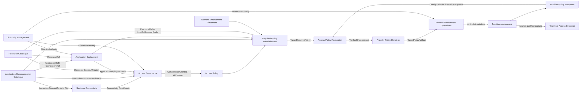

# NAPMS Context Map

Status: `S2 affected-edge convergence accepted for AD and minimal RC address realization; named AG behavior remains S1-open`.

Date: 2026-09-15.

This is the canonical strategic relationship map. `strategic-model.md` owns responsibilities/boundaries; `strategic-model.json` is the machine-readable projection.

## Core relationship map



Arrows show semantic ownership/data flow, not synchronous transport or deployment topology. No Shared Kernel is accepted.

## Affected public contracts

### ACC -> AD

`ApplicationRef / ComponentRef`. ACC owns application/component identity; AD owns deployment/placement lifecycle.

### RC -> AD

`opaque ResourceRef`. AD's `ComponentPlacement` references one Resource. RC retains Resource and network realization truth.

### ACC + AD -> AG

```text
GovernedInteractionSubject {
    interactionContractRevisionRef       // ACC
    sourceApplicationDeploymentRef       // AD
    destinationApplicationDeploymentRef  // AD
}
```

Scaling, ordinary placement replacement, Resource replacement and address change do not by themselves redefine this identity.

### RC -> AG

```text
ResourceRef + logicalTime
-> effective ResourceScopeAffiliation[] with validity/provenance
```

AG owns how these facts establish approval obligations.

### ACC -> RPM

`InteractionContractRevisionRef + complete immutable traffic contract`. ACC does not resolve deployments or Resources.

### AD -> RPM

```text
ApplicationDeploymentRef + ComponentRef + logicalTime
-> applicable ComponentPlacement[]
   containing ResourceRef
   + resolution/completeness state
```

### RC -> RPM

For current scope:

```text
ResourceRef + logicalTime
-> CurrentResourceRealization {
     addressSpace? : HostAddress | Prefix
     asOf
     resolution/completeness
     provenance/freshness
   }
```

One Resource has at most one effective AddressSpace at a logical time. Missing realization is unresolved, not an empty address set. Prefixes are first-class and need not be expanded to hosts.

`ResourceEndpoint`, endpoint purpose, multiple simultaneous addresses/interfaces, VIP and deployment-specific exposure are outside the current target model.

### NEP -> RPM

```text
TrafficPair
-> FirewallCandidate[]
-> AccessListLocator[]
```

Candidate membership is relevance-to-inspect, not proven path. Unknown/incomplete remains explicit.

### RPM -> APR and provider chain

`TargetRequiredPolicy` carries comparison scope, normalized required predicates, contributing PolicyRule refs, freshness/provenance and logical/effective time. PPI publishes configured effective policy; APR owns required/configured delta and verified change intent; PPR renders; NEO executes with independent mutation authority. `Applied` is not convergence proof.

## Application Deployment boundary decision

Boundary Challenge: **PASS**.

```text
ApplicationDeployment
    ApplicationDeploymentId
    ApplicationRef

ComponentPlacement
    ApplicationDeploymentRef
    ComponentRef
    ResourceRef
```

A placed Component must belong to the referenced Application. Not every Component must be placed. Exact aggregate/lifecycle and same-Component/same-Resource multiplicity remain Tactical.

The former ACC-owned `ComponentDeployment`, RC -> ACC deployment binding and `DirectedInteractionIdentity{ComponentDeploymentRef...}` are superseded.

## Current Resource network decision

The former endpoint-based target is simplified:

```text
Resource -> effective AddressSpace [0..1]
AddressSpace = HostAddress | Prefix
```

AD therefore needs no endpoint/network-exposure contract in the current scope. Future multi-address/interface requirements must reopen this affected edge rather than being pre-modelled now.

## Active S1 questions

1. What product constraints determine selectable source/destination `ApplicationDeployment` pairs for an Access Request?
2. If placement or Resource Scope Affiliation changes alter approval obligations, does current authorization remain valid, require reapproval, warn, or withdraw?
3. When several Responsibility Scopes are simultaneously applicable to one governance side, what approval obligations are required?

## Convergence result

Affected ownership/address edges are converged for current scope. No P0 ownership contradiction remains here. Foundational Tactical order is `ACC + RC -> AD -> AM`, followed by affected BC/AG/AP convergence and then downstream RPM/NEP/TAE/APR/NEO.