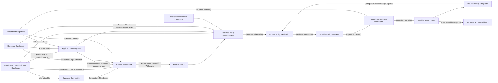

# NAPMS Context Map

Status: `S2 MVP target relationship map aligned 2026-09-15`.

Date: 2026-09-15.

This is the canonical strategic relationship map. `strategic-model.md` owns responsibilities/boundaries; `strategic-model.json` is the machine-readable projection.

## Core relationship map



Arrows show semantic ownership/data flow, not synchronous transport or deployment topology. No Shared Kernel is accepted.

Provider Policy Interpreter and Provider Policy Renderer are integration capabilities, not peer Bounded Contexts. Required Policy Materialization is a non-peer derived composition.

## Affected public contracts

### ACC -> Business Connectivity

Business Connectivity references stable `InteractionRef` as the application-semantic business need. A Need is not pinned to one concrete deployment or one immutable traffic revision.

For a concrete Access Request, AG combines the Need basis with the exact current/selected `InteractionContractRevisionRef` that defines the governed traffic semantics.

### ACC -> AD

`ApplicationRef / ComponentRef`. ACC owns application/component identity; AD owns logical deployment identity and current placement-set truth.

### RC -> AD

`opaque ResourceRef`. For MVP, AD `ComponentPlacement` is the relation value `(ComponentRef, ResourceRef)` inside one ApplicationDeployment current placement set. RC retains Resource and network realization truth.

### ACC + AD -> AG

```text
GovernedInteractionSubject {
    interactionContractRevisionRef       // ACC
    sourceApplicationDeploymentRef       // AD
    destinationApplicationDeploymentRef  // AD
}
```

Scaling, ordinary placement replacement, Resource replacement and address change do not by themselves redefine this identity.

For the MVP, the pair is selectable only when each selected ApplicationDeployment realizes the corresponding Interaction endpoint Component through at least one current placement and the current approval obligations are resolvable.

AG then requires exactly one distinct applicable Responsibility Scope per governance side. Zero or several applicable scopes fail closed for the MVP path.

### AD -> AG

AD publishes the complete current placement set needed to determine which Resources participate on each governance side.

```text
ApplicationDeploymentRef + endpoint ComponentRef
-> complete Set<ResourceRef> | unresolved
```

One Component may have zero, one or many placements. AG must preserve every applicable placement when resolving Resource Scope Affiliations; it must not choose one arbitrary Resource merely to obtain a simpler obligation result.

### RC -> AG

```text
ResourceRef + logicalTime
-> effective ResourceScopeAffiliation[] with validity/provenance
```

AG owns how these facts establish approval obligations.

A material change of the resolved source/destination obligation pair causes AG to publish `AuthorizationWithdrawn`; materially unchanged obligations preserve current authorization. Historical approvals do not silently restore a withdrawn grant.

### AM -> protected domain actions

AM evaluates effective authority for an exact:

```text
ActorRef + ActionRef + ResponsibilityScopeRef + effectiveTime
```

from effective group membership, role assignment and role-permitted action truth. Resource responsibility/contact metadata does not grant authority.

`Denied` and `Unknown` fail closed for protected actions. Historical consuming decisions may preserve the authority evidence valid at decision time without freezing current assignments.

### AG -> AP

```text
AuthorizationGranted(subject, provenance)
AuthorizationWithdrawn(subject, provenance)
```

AP does not reconstruct bilateral governance. A later explicit grant may re-establish current authorization for the same governed subject.

### ACC -> RPM

`InteractionContractRevisionRef + complete immutable traffic contract`. ACC does not resolve deployments or Resources.

A material traffic change creates a new immutable revision reference; old revisions remain historically resolvable.

### AD -> RPM

```text
ApplicationDeploymentRef + ComponentRef + logicalTime
-> complete applicable Set<(ComponentRef, ResourceRef)> | unresolved
```

A complete empty placement set is distinct from an unavailable/unresolved result. Multiple current placements are all part of required-policy materialization completeness.

### RC -> RPM

For current scope:

```text
ResourceRef + logicalTime
-> CurrentResourceRealization {
     addressSpace? : HostAddress | Prefix
     asOf
     resolution/completeness
     provenance/freshness
   }
```

One Resource has at most one effective AddressSpace at a logical time. Missing realization is unresolved, not an empty address set. Prefixes are first-class and are not expanded into hosts.

`ResourceEndpoint`, endpoint purpose, multiple simultaneous addresses/interfaces, VIP and deployment-specific exposure are outside the current target model.

### NEP -> RPM

```text
TrafficPair
-> FirewallCandidate[]
   firewallId
   accessListNames[]
   freshness metadata
```

Candidate membership is relevance-to-inspect/affect, not a proven path. Multiple candidates are preserved; order has no route meaning.

For the first end-to-end MVP vertical path, RPM calls this edge only with HostAddress-to-HostAddress pairs. If RC supplies a Prefix on either side, RPM returns unresolved until Prefix-aware NEP query/matching semantics are explicitly designed.

A candidate with no access-list locator is valid NEP output but cannot form an RPM/APR comparison scope and therefore leaves the affected materialization unresolved.

### RPM -> APR

RPM groups normalized required permit predicates by:

```text
ComparisonScope = firewallId + accessListName
```

and publishes only complete target-specific results:

```text
TargetRequiredPolicy {
    comparisonScope
    requiredPermitSpace
    contributingPolicyRuleRefs
    logicalTime
    inputProvenance
    inputFreshness
}
```

Missing/incomplete upstream evidence, missing candidate target or missing policy locator is `unresolved`, never empty required policy.

### Provider Policy Interpreter -> APR

PPI publishes `ConfiguredEffectivePolicySnapshot` for the exact same ComparisonScope, with explicit completeness and unsupported-semantics information. APR does not parse raw provider syntax.

TAE may preserve source-qualified evidence but does not select current/complete configured-policy truth for APR.

### APR -> Provider Policy Renderer

For complete comparable input APR computes exact source-neutral:

```text
common  = required ∩ configured
missing = required - configured
excess  = configured - required
```

The MVP remediation boundary is additive-only:

```text
missing -> VerifiedChangeIntent(operation = ENSURE-PERMIT)
excess  -> report/audit only; no automatic removal
Realized -> no intent
Uncomparable -> no intent
```

The target has no accepted managed-policy scope proving that NAPMS owns all configured permit space in an ACL. Therefore `excess` is not automatic removal authority.

`VerifiedChangeIntent` is an immutable semantic handoff value for the MVP, not an independently persisted remediation aggregate.

### Provider Policy Renderer -> NEO

Provider Policy Renderer is an integration capability. It translates a verified source-neutral intent into provider/target representation only when semantic equivalence can be established.

```text
VerifiedChangeIntent
+ TargetProviderCapabilities
+ base target revision/correlation
    -> TargetPolicyArtifact {
         targetRef
         comparisonScope
         baseTargetCorrelation
         rendererIdentity/version
         artifactContent
         artifactDigest
         semanticEquivalenceEvidence
         intentProvenance
       }
```

If exact supported rendering/equivalence cannot be established, no executable artifact is published.

### NEO -> provider environment

NEO owns controlled execution only:

```text
TargetPolicyArtifact
+ actor / mutation authority scope
+ operationId / preconditions
    -> NetworkOperation outcome
```

NEO does not recompute APR intent or rewrite provider representation. Mutation requires explicit Authority Management admission and successful stale/concurrency pre-checks.

`Applied` is only a transport/apply result. NEO `Verified` is immediate artifact/application verification, not final semantic convergence proof. Final convergence requires later provider observation/interpreter publication and APR comparison again.

## Application Deployment boundary decision

Boundary Challenge: **PASS**.

```text
ApplicationDeployment {
    ApplicationDeploymentId
    ApplicationRef
    currentPlacements: Set<(ComponentRef, ResourceRef)>
}
```

MVP Tactical semantics are closed:

- `ComponentPlacement` is a relation value, not a separately identified entity;
- one Component may have zero, one or many distinct current Resource placements;
- the exact same `(ComponentRef, ResourceRef)` pair is not duplicated;
- scaling/migration/placement replacement preserve ApplicationDeployment identity while logical deployment continuity remains;
- no deployment lifecycle state machine is invented because current accepted behavior does not require one;
- complete empty placement truth and unresolved placement truth remain distinct.

The former ACC-owned `ComponentDeployment`, RC -> ACC deployment binding and `DirectedInteractionIdentity{ComponentDeploymentRef...}` are superseded target semantics.

## Current Resource network decision

The former endpoint-based target is simplified:

```text
Resource -> effective AddressSpace [0..1]
AddressSpace = HostAddress | Prefix
```

AD therefore needs no endpoint/network-exposure contract in the current scope. Future multi-address/interface requirements must reopen this affected edge rather than being pre-modelled now.

## Deferred affected-edge extensions

The following are explicit non-blocking future extensions:

- generalized Access Governance behavior for several simultaneous Responsibility Scopes on one side;
- nested groups, role inheritance, explicit deny/ABAC authority rules;
- Prefix-aware NEP TrafficPair semantics;
- managed-policy ownership/removal semantics for APR `excess`;
- richer APR change-design vocabulary beyond additive `ENSURE-PERMIT`;
- durable/editable APR remediation plans if a concrete user journey requires them;
- several simultaneous Resource addresses/interfaces, endpoint purpose, VIP and deployment-specific exposure;
- richer ApplicationDeployment lifecycle/history where observable behavior later requires it;
- richer ACC revision workflow/version presentation beyond immutable contract snapshots.

## Convergence result

The first MVP semantic path is coherent across all target bounded contexts and non-peer integration/composition boundaries needed by it.

Known future cases are explicitly deferred or fail closed; they are not hidden as unresolved current behavior.

Final G2 status for the full MVP DDD baseline is recorded in the dedicated convergence checkpoint. No implementation authorization is implied by this map.
