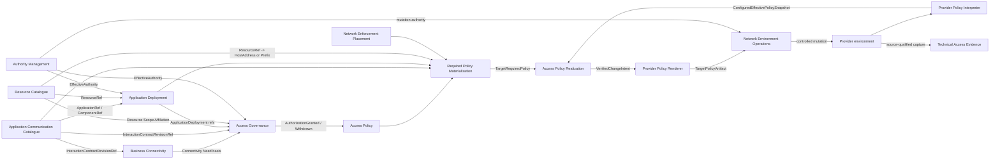

# NAPMS Context Map

Status: `S2 thin-vertical convergence accepted through AG/AP and MVP RPM edge`.

Date: 2026-09-15.

This is the canonical strategic relationship map. `strategic-model.md` owns responsibilities/boundaries; `strategic-model.json` is the machine-readable projection.

## Core relationship map



Arrows show semantic ownership/data flow, not synchronous transport or deployment topology. No Shared Kernel is accepted.

## Affected public contracts

### ACC -> AD

`ApplicationRef / ComponentRef`. ACC owns application/component identity; AD owns deployment/placement lifecycle.

### RC -> AD

`opaque ResourceRef`. AD's `ComponentPlacement` references one Resource. RC retains Resource and network realization truth.

### ACC + AD -> AG

```text
GovernedInteractionSubject {
    interactionContractRevisionRef       // ACC
    sourceApplicationDeploymentRef       // AD
    destinationApplicationDeploymentRef  // AD
}
```

Scaling, ordinary placement replacement, Resource replacement and address change do not by themselves redefine this identity.

For the MVP, the pair is selectable only when both endpoint Components can be realized by the selected ApplicationDeployments and each governance side resolves to exactly one distinct applicable Responsibility Scope. Zero or several applicable scopes fail closed.

### RC -> AG

```text
ResourceRef + logicalTime
-> effective ResourceScopeAffiliation[] with validity/provenance
```

AG owns how these facts establish approval obligations.

A material change of the resolved approval obligations causes AG to publish `AuthorizationWithdrawn`; materially unchanged obligations preserve current authorization. Historical approvals do not silently restore a withdrawn grant.

### AG -> AP

```text
AuthorizationGranted(subject, provenance)
AuthorizationWithdrawn(subject, provenance)
```

AP does not reconstruct bilateral governance. A later explicit grant may re-establish current authorization for the same subject.

### ACC -> RPM

`InteractionContractRevisionRef + complete immutable traffic contract`. ACC does not resolve deployments or Resources.

### AD -> RPM

```text
ApplicationDeploymentRef + ComponentRef + logicalTime
-> applicable ComponentPlacement[]
   containing ResourceRef
   + resolution/completeness state
```

### RC -> RPM

For current scope:

```text
ResourceRef + logicalTime
-> CurrentResourceRealization {
     addressSpace? : HostAddress | Prefix
     asOf
     resolution/completeness
     provenance/freshness
   }
```

One Resource has at most one effective AddressSpace at a logical time. Missing realization is unresolved, not an empty address set. Prefixes are first-class and are not expanded into hosts.

`ResourceEndpoint`, endpoint purpose, multiple simultaneous addresses/interfaces, VIP and deployment-specific exposure are outside the current target model.

### NEP -> RPM

```text
TrafficPair
-> FirewallCandidate[]
   firewallId
   accessListNames[]
   freshness metadata
```

Candidate membership is relevance-to-inspect/affect, not a proven path. Multiple candidates are preserved; order has no route meaning.

For the first end-to-end MVP vertical path, RPM calls this edge only with HostAddress-to-HostAddress pairs. If RC supplies a Prefix on either side, RPM returns unresolved until Prefix-aware NEP query/matching semantics are explicitly designed.

A candidate with no access-list locator is valid NEP output but cannot form an RPM/APR comparison scope and therefore leaves the affected materialization unresolved.

### RPM -> APR and provider chain

RPM groups normalized required permit predicates by:

```text
ComparisonScope = firewallId + accessListName
```

and publishes only complete target-specific results:

```text
TargetRequiredPolicy {
    comparisonScope
    requiredPermitSpace
    contributingPolicyRuleRefs
    logicalTime
    inputProvenance
    inputFreshness
}
```

Missing/incomplete upstream evidence, missing candidate target or missing policy locator is `unresolved`, never empty required policy.

PPI publishes configured effective policy for the same comparison scope; APR owns required/configured delta and verified change intent; PPR renders; NEO executes with independent mutation authority. `Applied` is not convergence proof.

## Application Deployment boundary decision

Boundary Challenge: **PASS**.

```text
ApplicationDeployment
    ApplicationDeploymentId
    ApplicationRef

ComponentPlacement
    ApplicationDeploymentRef
    ComponentRef
    ResourceRef
```

A placed Component must belong to the referenced Application. Not every Component must be placed. Exact aggregate/lifecycle and same-Component/same-Resource multiplicity remain Tactical.

The former ACC-owned `ComponentDeployment`, RC -> ACC deployment binding and `DirectedInteractionIdentity{ComponentDeploymentRef...}` are superseded.

## Current Resource network decision

The former endpoint-based target is simplified:

```text
Resource -> effective AddressSpace [0..1]
AddressSpace = HostAddress | Prefix
```

AD therefore needs no endpoint/network-exposure contract in the current scope. Future multi-address/interface requirements must reopen this affected edge rather than being pre-modelled now.

## Deferred affected-edge extensions

The following are explicit non-blocking future extensions:

- generalized Access Governance behavior for several simultaneous Responsibility Scopes on one side;
- Prefix-aware NEP TrafficPair semantics;
- several simultaneous Resource addresses/interfaces, endpoint purpose, VIP and deployment-specific exposure.

## Convergence result

The ACC/AD/RC foundation, Access Governance MVP behavior, AG/AP Tactical handoff and first HostAddress-based RPM vertical path are coherent for the current scope. No open S1 Access Governance blocker remains for the happy path.

Global G2 is not implied. Continue downstream and reopen only the specific affected edge when a concrete deferred case becomes necessary.
