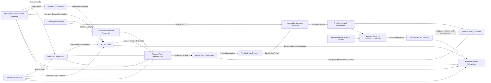

# NAPMS Context Map

Status: `S2 relationship and dependent Tactical DDD aligned; G2 PASS 2026-09-16`.

Date: 2026-09-16.

This is the canonical strategic relationship map. `strategic-model.md` owns responsibilities/boundaries; `strategic-model.json` is the machine-readable projection.

## Core relationship map



Arrows are semantic contracts/data flow, not transport or deployment topology. No Shared Kernel is accepted.

`Access Governance` is not a separate target Bounded Context. Its proposal/approval/rejection/withdrawal responsibilities are part of the Access Policy lifecycle. Required Policy Materialization and Evidence Access Recognition are non-peer compositions; PPI/PPR/acquisition are integration/application capabilities.

## Public contracts

### ACC -> Business Connectivity

Business Connectivity consumes stable `InteractionRef` for application-semantic Need meaning. A Need is independent from concrete deployments and exact revisions.

### ACC -> Application Deployment

```text
ComponentRef
```

AD consumes opaque Component identity and owns concrete deployment identity. ACC owns Application/Component meaning.

### RC -> Application Deployment

```text
ResourceRef
```

For the first MVP:

```text
ComponentDeploymentRef
-> ComponentRef
-> ResourceRef
```

One ComponentDeployment resolves to exactly one Component and one Resource. Deploying the same Component on another Resource creates another ComponentDeployment.

### ACC + AD -> Access Policy

One concrete Rule uses:

```text
sourceComponentDeploymentRef
destinationComponentDeploymentRef
revisionRef
```

The directed ComponentDeployment pair is the concrete Rule subject/business uniqueness. `revisionRef` is proposed/current traffic semantics, not Rule identity.

AP resolves the exact revision and validates:

```text
sourceDeployment.componentRef == revision.interaction.sourceComponentRef
destinationDeployment.componentRef == revision.interaction.destinationComponentRef
```

Because ACC Interactions are intra-Application, this also prevents cross-Application Rule connections. A duplicate `InteractionRef` is unnecessary when the exact revision is already known.

### AD -> Access Policy

```text
ComponentDeploymentRef
-> ComponentRef
-> ResourceRef
| unresolved
```

The target has no whole-Application deployment selection or placement-set expansion in policy governance. Address change on the same Resource does not replace ComponentDeployment identity; a separately deployed Component instance is a distinct policy endpoint.

### RC -> Access Policy

```text
ResourceRef + logicalTime
-> effective ResourceScopeAffiliation[] + provenance
```

AP owns how those public facts establish source/destination approval obligations. The MVP requires exactly one distinct applicable Responsibility Scope per side; zero or several fail closed.

### AM -> Access Policy

```text
ActorRef + ActionRef + ResponsibilityScopeRef + effectiveTime
-> Admitted | Denied | Unknown
+ authority provenance
```

Denied/Unknown fail closed. Resource responsibility/contact metadata is not authority.

### Business Connectivity -> Access Policy

Deliberate RuleChange submission requires a current Process-backed Connectivity Need/business basis. AP preserves the basis used for the change; Need existence never implies authorization.

Evidence recognition may produce a candidate before Need attribution, but cannot bypass the submission/business-basis requirement.

### Access Policy internal lifecycle

Within one PolicyRule, these remain distinct:

```text
stable PolicyRuleId / PolicyRuleRef
immutable source/destination ComponentDeployment pair
effectiveRevisionRef?
RuleChange[]: Pending | Approved | Rejected
bilateral decisions / approval basis
withdrawal/regrant history
```

A Pending or Rejected RuleChange never overwrites current effective revision. An applicable Approved change may advance the same Rule. Withdrawal clears effectiveness without deleting history; old approvals cannot silently restore it.

### Access Policy -> RPM

AP publishes current effective Rules only:

```text
EffectivePolicyRule {
    policyRuleRef
    sourceComponentDeploymentRef
    destinationComponentDeploymentRef
    revisionRef
    authorizationProvenance
}
```

Pending/rejected history is not required policy.

### ACC -> RPM

```text
InteractionContractRevisionRef
-> owning Interaction endpoint ComponentRefs
-> complete immutable trafficAlternatives
```

ACC owns no deployment/resource realization.

### AD -> RPM

```text
ComponentDeploymentRef
-> ComponentRef
-> ResourceRef
| unresolved
```

Each Rule already names one concrete source and destination deployment; RPM does not perform replica/placement Cartesian expansion.

### RC -> RPM

```text
ResourceRef + logicalTime
-> CurrentResourceRealization {
     addressSpace? : HostAddress | Prefix
     resolution/completeness
     provenance/freshness
   }
```

Missing realization is unresolved, not empty. Prefix remains Prefix and is never expanded merely to continue the pipeline.

### NEP -> RPM

```text
TrafficPair
-> FirewallCandidate[]
   firewallId
   accessListNames[]
   freshness
```

Candidates are relevance-to-inspect/affect, not proven routes. Multiple candidates are preserved. The first target-specific edge accepts HostAddress-to-HostAddress only; Prefix yields unresolved until Prefix-aware semantics are accepted.

### RPM -> APR

```text
ComparisonScope = firewallId + accessListName

TargetRequiredPolicy {
    comparisonScope
    requiredPermitSpace
    contributingPolicyRuleRefs
    logicalTime
    inputProvenance
    inputFreshness
}
```

Only complete results are published. Missing/incomplete upstream truth is `unresolved`, never empty required policy.

### Acquisition -> TAE

Collectors/import adapters own collection and faithful translation into TAE's published evidence contract. TAE owns normalized evidence meaning/history, not polling, credentials, retry or source transport.

### TAE + RC + AD + ACC -> Evidence Access Recognition

Evidence Access Recognition may correlate:

```text
TAE address/protocol/port predicate
-> RC Resource correlation
-> AD ComponentDeployment correlation
-> ACC exact Component/Interaction/revision match
-> RecognizedAccessCandidate | unresolved/ambiguous
```

It fails closed on missing/ambiguous correlation and cannot manufacture Resource, deployment, ACC revision, Need or authorization.

### Evidence Access Recognition -> Access Policy

A recognized candidate may seed the same RuleChange path as manual creation and carries evidence provenance. AP remains the owner of formal submission, approval and current policy.

### TAE -> PPI -> APR

Configured evidence may be selected by an explicit source contract for Provider Policy Interpreter. PPI publishes `ConfiguredEffectivePolicySnapshot` with explicit scope/completeness/freshness/unsupported semantics. APR never parses raw provider syntax.

### APR -> PPR -> NEO

APR owns exact source-neutral comparison and additive `ENSURE-PERMIT` intent for missing required access. Provider renderer must preserve semantic equivalence. NEO owns controlled mutation. Execution success is not final convergence proof.

## Boundary decisions

### Application Deployment

**PASS.** Target aggregate meaning is:

```text
ComponentDeployment {
    ComponentDeploymentId
    ComponentRef
    ResourceRef
}
```

It is one concrete Component-on-Resource instance. The target policy lifecycle requires no whole-Application `ApplicationDeployment` identity. As-built ACC compatibility `ComponentDeployment` remains a different implementation/reconstruction concept where documented.

### Access Policy

**PASS.** The former split:

```text
AG GovernedAuthorization.effectiveGrant
-> AuthorizationGranted/Withdrawn
-> AP current PolicyRule
```

contained two owners of the same current authorization fact. In the revalidated target, proposal/approval/current-revision/withdrawal are one PolicyRule lifecycle inside Access Policy. Business Connectivity and Authority Management remain separate because their identities and lifecycles are independently meaningful.

## Deferred affected-edge extensions

- several simultaneous Responsibility Scopes per approval side;
- several simultaneous Pending RuleChanges and ordering/conflict semantics;
- whether several ComponentDeployments may share one Resource as a product restriction;
- richer ComponentDeployment runtime/container history;
- Prefix-aware NEP semantics;
- several simultaneous Resource addresses/interfaces/VIPs;
- richer ACC revision workflow/version presentation;
- managed-policy automatic removal/narrowing semantics;
- concrete acquisition/provider realization details in S3/S4.

## Convergence result

Strategic relationships and dependent Tactical semantics are coherent for the revalidated first-MVP slice. `mvp-ddd-convergence-checkpoint.md` records `G2 PASS`.

No implementation authorization is implied. S3 Architecture may rely on these public semantic contracts.
