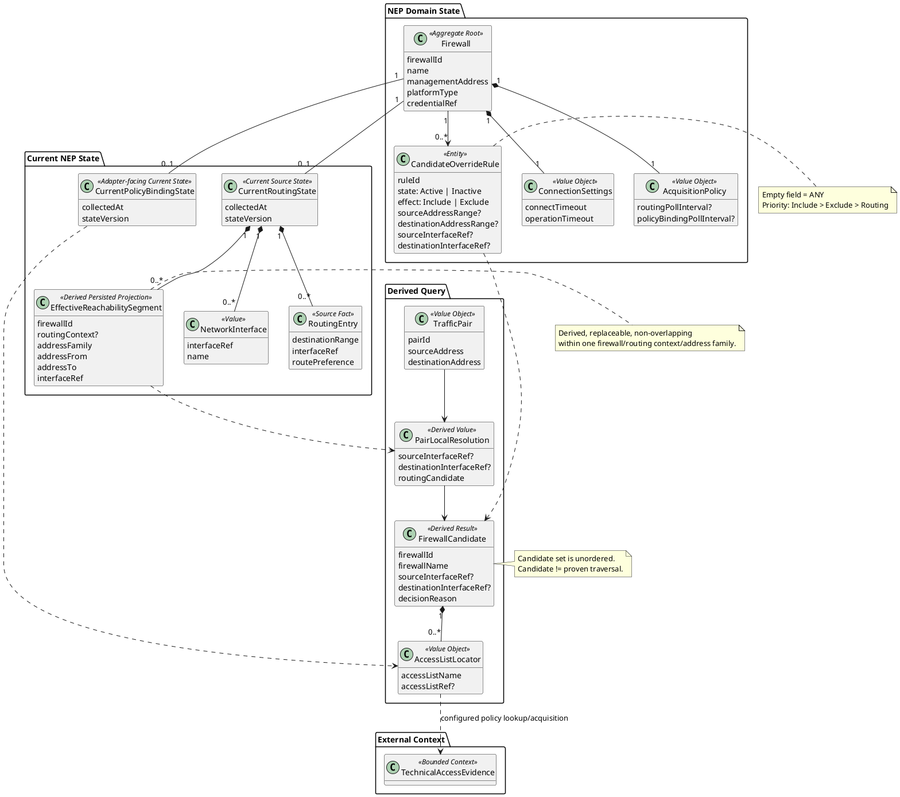

# Network Enforcement Placement — Target Tactical Model

Status: `accepted target Tactical DDD model; implementation migration pending`.

Date: 2026-09-13.

Decision: `../../decisions/ADR-018-nep-firewall-current-state-candidate-model.md`.

This document is the canonical MVP target model for NEP. `tactical-model.md` remains historical/current-runtime documentation for the stronger I19 proven-path implementation until migration is completed.

## 1. Purpose

Network Enforcement Placement answers:

> for each technical source/destination address pair, which known firewalls are relevant candidates to inspect, which local interfaces resolve the pair on each candidate, and which ACL/policy objects must be inspected downstream?

The context deliberately separates:

```text
candidate relevance
!=
proven end-to-end traversal
```

Candidate uncertainty exists at the firewall-selection layer. For a supported firewall adapter and a successfully collected current state, local routing/interface resolution and relevant policy-locator extraction are deterministic with respect to that state.

## 2. Boundary and ownership

| Knowledge | Owner | Notes |
|---|---|---|
| Firewall identity/profile used for NEP acquisition | NEP | `Firewall` is the unit of account; no separate physical Device entity in MVP |
| Current routing/interface state | NEP | only latest successfully collected current state |
| Effective non-overlapping reachability index | NEP derived projection | rebuildable from current routing state |
| Candidate override rules | NEP | user-authored Include/Exclude rules |
| Candidate calculation | NEP | routing baseline + override precedence |
| Relevant ACL/policy locator set | NEP | locator only; vendor attachment mechanics remain adapter knowledge |
| Configured ACL/policy contents | Technical Access Evidence | entries, predicates, Permit/Block evidence |
| Resource/application identity | Resource Catalogue / Application Communication Catalogue | external to NEP |
| Desired policy and reconciliation | Access Policy / Access Policy Realization | downstream/peer concerns |
| Vendor configuration rendering/execution | rendering/Network Environment Operations | outside NEP |

NEP is not a generic CMDB. A firewall is not stored as a Resource Catalogue `Resource` merely because it is infrastructure. Resource identity remains independent from Firewall identity.

## 3. Ubiquitous language

### Firewall

`Firewall` is one independently addressed and analysed firewall context with its own routing/interface/policy-binding semantics.

The term intentionally replaces `LogicalFirewall` in the MVP target vocabulary because no competing physical-device domain entity is modelled.

Minimum target profile:

```text
Firewall
    firewallId
    name
    managementAddress
    platformType
    credentialRef / connectionProfileRef
    connectionSettings
    acquisitionPolicy
```

The exact lifecycle/command model is deferred.

### Traffic Pair

A `TrafficPair` is an ephemeral query value:

```text
TrafficPair
    pairId
    sourceAddress
    destinationAddress
```

The application accepts `1..N` pairs. `pairId` is a correlation value for batch input/output; it is not persistent domain identity.

The MVP query has no `asOf`; it evaluates the current successfully collected NEP state.

### Firewall Candidate

A `FirewallCandidate` means:

> according to the current NEP routing model and user overrides, this firewall is relevant enough to inspect for this pair.

It does not assert that traffic definitely traverses the firewall. Candidate order has no route meaning.

### Access List Locator

An `AccessListLocator` identifies a policy/ACL object that must be inspected for one candidate/pair:

```text
AccessListLocator
    accessListName
    accessListRef?
```

NEP does not expose attachment kind/direction/position in the current target because no accepted consumer requires those distinctions.

## 4. Aggregate and state model

### 4.1 Firewall aggregate

`Firewall` is the primary NEP-owned persistent identity.

Target profile value objects:

```text
ConnectionSettings
    connectTimeout
    operationTimeout

AcquisitionPolicy
    routingPollInterval?
    policyBindingPollInterval?
```

Intervals may differ per firewall because source volatility and connection cost differ. A missing scheduled interval may represent on-demand acquisition only.

Secret values are not stored in the aggregate; only an opaque credential/profile reference is retained.

### 4.2 Candidate Override Rule

`CandidateOverrideRule` is a persistent NEP entity targeted at one Firewall:

```text
CandidateOverrideRule
    ruleId
    firewallId
    state: Active | Inactive
    effect: Include | Exclude

    sourceAddressRange?
    destinationAddressRange?
    sourceInterfaceRef?
    destinationInterfaceRef?
```

Empty match fields mean `ANY`.

Only Active rules participate.

### 4.3 Current routing state

NEP stores current state, not a historical snapshot series:

```text
CurrentRoutingState
    firewallId
    collectedAt
    stateVersion
    interfaces[]
    routingEntries[]
```

A refresh constructs and validates a replacement state and its derived reachability projection before atomically publishing the new logical version. The old version may then be discarded.

`stateVersion` is a technical consistency mechanism, not historical domain identity.

### 4.4 Current policy-binding state

Policy-binding/locator acquisition may have a different refresh cadence from routing acquisition and may remain vendor-shaped behind an adapter.

The domain requirement is only that NEP can resolve the complete `AccessListLocator[]` required for a candidate/pair according to the supported firewall platform semantics.

NEP does not require a universal persisted attachment-topology entity.

## 5. Effective Reachability Index

Raw routing contains overlapping prefixes and precedence. Candidate calculation uses a derived persisted projection instead:

```text
EffectiveReachabilitySegment
    firewallId
    routingContext?
    addressFamily
    addressFrom
    addressTo
    interfaceRef
```

Meaning:

> for this firewall/routing context, any address inside the segment resolves to `interfaceRef` after supported routing precedence has been applied.

Invariants:

- within one firewall + routing context + address family, effective segments do not overlap;
- the projection is rebuildable and replaceable;
- it is not authoritative routing truth;
- the projection switches atomically with the current routing state from which it was derived;
- unsupported/ambiguous routing semantics must not be resolved by arbitrary representation order.

The persisted projection exists so candidate calculation can be set-based in PostgreSQL instead of looping through every firewall and routing table in backend code.

## 6. Candidate calculation

For every pair/firewall combination, resolve source and destination interfaces from the effective reachability index.

Routing baseline:

```text
both source and destination resolve
AND sourceInterface != destinationInterface
    => routingCandidate = true

otherwise
    => routingCandidate = false
```

A missing resolution is ordinary `false` for the routing baseline; override evaluation still runs.

### Override matching

A rule matches iff every non-empty condition matches:

```text
(sourceAddressRange is ANY
 OR sourceAddress in sourceAddressRange)
AND
(destinationAddressRange is ANY
 OR destinationAddress in destinationAddressRange)
AND
(sourceInterfaceRef is ANY
 OR resolvedSourceInterface == sourceInterfaceRef)
AND
(destinationInterfaceRef is ANY
 OR resolvedDestinationInterface == destinationInterfaceRef)
```

If an interface condition is non-empty and the corresponding interface was not resolved, the condition does not match.

### Precedence

```text
if any matching Include rule exists:
    finalCandidate = true
else if any matching Exclude rule exists:
    finalCandidate = false
else:
    finalCandidate = routingCandidate
```

Therefore:

```text
Include > Exclude > Routing
```

This is intentionally conservative toward inclusion: when conflicting manual knowledge exists, retaining a potentially relevant firewall is safer than dropping it from downstream inspection.

## 7. Batch/set-based query shape

The intended application/query flow is:

```text
TrafficPair[]
    -> SQL set-based source/destination reachability lookup
    -> per pair/firewall local resolution
    -> routingCandidate
    -> Include/Exclude override evaluation
    -> unordered FirewallCandidate[]
    -> resolve relevant AccessListLocator[] per candidate
```

A conceptual intermediate row is:

```text
PairLocalResolution
    pairId
    firewallId
    sourceInterfaceRef?
    destinationInterfaceRef?
    routingCandidate
```

Candidate output:

```text
TrafficPairResult
    pairId
    candidates[]

FirewallCandidate
    firewallId
    firewallName
    sourceInterfaceRef?
    destinationInterfaceRef?
    accessLists[]
    decisionReason
```

Useful decision reasons include:

```text
IncludedByRouting
ExcludedByRouting
IncludedByOverride
ExcludedByOverride
```

Candidate output is unordered.

## 8. Policy locator resolution

For one candidate firewall, the adapter is responsible for source-specific knowledge needed to determine which ACL/policy objects are relevant for the pair and resolved interfaces.

Conceptual port:

```text
ResolveRelevantAccessLists(
    firewall,
    sourceAddress,
    destinationAddress,
    sourceInterfaceRef?,
    destinationInterfaceRef?
) -> AccessListLocator[]
```

The core domain does not require the adapter to expose whether a returned list was inbound, outbound, global or attached by another vendor-specific mechanism.

Zero returned locators is a valid known result for that supported current state.

## 9. Acquisition architecture

Acquisition is source-specific outer-adapter/application infrastructure, not peer-context domain logic.

### NEP acquisition

NEP reads only what NEP needs:

```text
interfaces
routing
minimal policy-binding/locator metadata
```

It must not fetch complete ACL bodies merely as a side effect of refreshing routing state.

### Technical Access Evidence acquisition

TAE independently acquires policy/ACL bodies when configured policy evidence is needed. It may ideally fetch only the policies named by `AccessListLocator` values.

The two acquisitions may differ in:

- time;
- frequency;
- triggering workflow;
- source command/API;
- timeout/cost;
- capture identity.

A shared low-level vendor transport client is allowed, but transport reuse does not merge bounded-context ownership.

## 10. Canonical ERD



## 11. Entity/value-object/persistence table

| Concept | Tactical type | Persistence | Identity/lifecycle |
|---|---|---|---|
| `Firewall` | Aggregate Root | yes | stable `firewallId`; lifecycle commands deferred |
| `ConnectionSettings` | Value Object | inside Firewall | no identity |
| `AcquisitionPolicy` | Value Object | inside Firewall | no identity |
| `CandidateOverrideRule` | Entity | yes | stable `ruleId`; MVP state `Active/Inactive` |
| `CurrentRoutingState` | current source state | yes/current only | replaced atomically; no history identity required |
| `NetworkInterface` | current-state value | yes/current only | source-qualified `interfaceRef` within Firewall state |
| `RoutingEntry` | normalized current source fact | optional/current implementation state | no independent business identity required |
| `EffectiveReachabilitySegment` | derived persisted projection | yes | rebuildable; no business identity |
| `CurrentPolicyBindingState` | adapter-facing current state | if adapter needs persistence | replaceable/current only |
| `TrafficPair` | Value Object/query value | no | no persistent identity |
| `PairLocalResolution` | derived value | no | none |
| `FirewallCandidate` | derived result | no | none |
| `AccessListLocator` | Value Object | result/current adapter state | source locator semantics only |

## 12. Cross-context contracts

| Direction | Contract | Meaning |
|---|---|---|
| NEP -> TAE/downstream composition | `firewallId + AccessListLocator` plus source-adapter correlation | locate/acquire configured ACL/policy evidence |
| TAE -> NEP | none required for candidate calculation | policy contents do not determine placement relevance |
| RC/ACC -> NEP | technical source/destination addresses are supplied by outer composition | NEP does not import RC/ACC core types |
| NEP -> APR/Checker | pair -> unordered firewall candidates + local interfaces + access-list locators | placement/relevance input only |

No cross-context table navigation or peer-schema foreign keys are part of the domain contract.

## 13. Accepted invariants

1. `Firewall` is the NEP unit of account; no separate physical Device entity is required by MVP.
2. Query input is `TrafficPair[1..N]`; each pair is evaluated independently.
3. MVP candidate queries use current state and do not take `asOf`.
4. Candidate membership is relevance-to-inspect, not proof of traversal.
5. Candidate order has no route meaning.
6. Base routing inclusion requires both addresses to resolve to different interfaces.
7. Missing source/destination resolution yields routing `NotCandidate` but never suppresses override evaluation.
8. Empty override match fields mean `ANY`.
9. Only Active override rules participate.
10. `Include > Exclude > Routing`.
11. A non-empty interface condition cannot match an unresolved interface.
12. NEP retains only the latest successfully collected current state required by the MVP.
13. Current-state replacement and its reachability projection switch atomically.
14. Effective reachability segments are non-overlapping within their firewall/routing-context/address-family scope.
15. Effective reachability is a derived/rebuildable projection, not source truth.
16. Candidate calculation should be set-based in the database rather than per-firewall backend loops.
17. NEP returns ACL/policy locators, not configured policy bodies.
18. Attachment direction/kind/topology is adapter knowledge until a domain consumer requires it.
19. NEP and TAE acquisition are independent and may have different schedules/costs/source operations.
20. Per-firewall connection timeouts and acquisition intervals are configurable.
21. `collectedAt` is retained for current-state age/explainability; it is not historical query time.

## 14. Current implementation gap

### P0

- Current I19/I26 runtime is centred on `ProviderRealizationReference`, optional `LogicalFirewall` correlation, historical/effective-time captures and path/candidate snapshots. Target identity is directly `Firewall`.
- Current candidate contract is per pair + `asOf`; target application contract is batch pairs evaluated against current state.
- Current candidate model treats interfaces/policy attachment metadata as optional source annotations. Target derives candidate relevance itself from current routing plus overrides.
- Candidate override rules do not exist in the current accepted runtime model.
- Current persistence is not organized around a single current routing state + atomically replaceable effective reachability projection.

### P1

- Current ADR-017 policy attachment shape contains `attachmentKind/interface/direction`; target core result needs only `AccessListLocator`.
- Current acquisition model does not yet express independent NEP routing/policy-binding collection versus on-demand TAE policy-body collection.
- Firewall-specific platform/connection/acquisition profile is not yet a locked runtime model.

### P2

- Existing stronger I19 proven-path capability may remain as optional compatibility/history code during migration, provided it is not used to infer target candidate semantics.

No implementation migration is authorized by this document alone; migration planning follows after the target model is accepted across dependent contexts.

## 15. Deferred questions

The following remain intentionally open for the next review:

- exact Firewall lifecycle and commands (`create/update/activate/deactivate/...`);
- mutation/concurrency/idempotency rules for Firewall profile changes;
- exact secret/profile storage and resolution mechanism;
- retry/backoff/scheduler failure semantics;
- exact normalization of source-specific ECMP/PBR/VRF/multipath cases when such a supported firewall requires it;
- final migration roadmap from current I19/I26 code and persistence.
